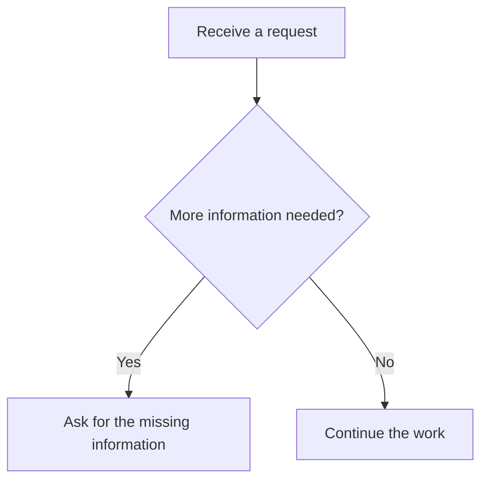

# Inline flow descriptions

The Web conversation renders supported Mermaid `flowchart` or `graph` blocks as a readable component inside the original message. The default view draws a connected left-to-right flow: parallel branches occupy separate lanes, conditions appear on arrowed connections, and shared endpoints appear once with all incoming arrows. Branches are visible without opening disclosures. Click a step to inspect its full text and incoming/outgoing relationships, including return connections. “Original description” keeps the exact source and its copy button.

For example:

Drag with a mouse or scroll on touch/keyboard to follow the flow. Overview fits the complete structure; Read restores the text size. Branches brings the first split into view, and zoom controls retain the viewport center. This is a read-only display: clicking a step does not select an answer or execute its contents. Rendering uses the existing message pipeline, without a separate page, image, framework, remote service, or additional model call. Same-message rerenders retain zoom, position, the selected step and source disclosure for unchanged flow descriptions. Existing messages gain the same display after loading the updated frontend.

Supported input includes `TD`, `TB`, `LR`, `RL`, and `BT` headers; standalone or referenced nodes; square, round, or decision labels; chained `-->`, `==>`, and `-.->` connections; and `|condition|` labels. Layout directions are accepted as source metadata; the display always runs left to right with explicit connections. DFS return edges are excluded only while ranking columns; they remain visible as dashed arrows. Longer connections route above the cards. A plain untagged code fence starting with a supported header also works. Other languages are never converted.

Incomplete streamed blocks, conflicting declarations, unsupported Mermaid syntax, or inputs over 30,000 characters, 64 nodes, or 128 edges remain ordinary code. The renderer never silently discards an unsupported line. Labels are inserted as text. Cards and connection labels limit long text to their available space; selecting the connected step shows the complete text and conditions. Source messages and durable history are not rewritten.

Implementation: `static/chat/inline-flow.js`, called by `renderMarkdownIntoNode` in `static/chat/ui.js`. Styles use the existing theme variables in `chat-messages.css`. The script is loaded in both the normal/shared template and the compatibility asset loader.
