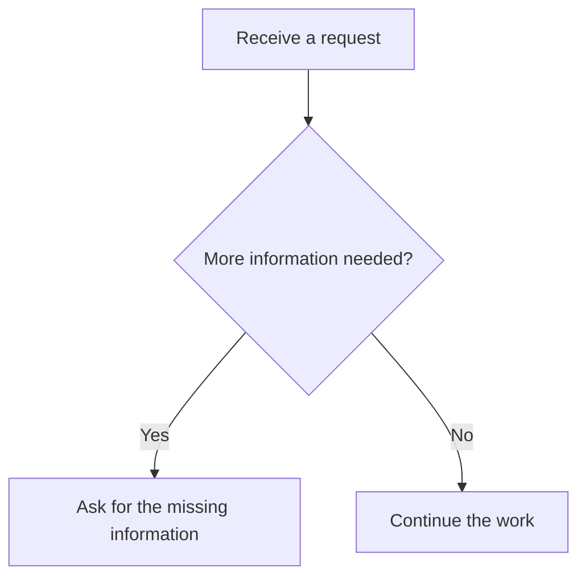

# Inline flow descriptions

The Web conversation renders supported Mermaid `flowchart` or `graph` blocks as a readable component inside the original message. The default view follows a sequence until it branches; readers expand each branch in place. Node disclosures show incoming relations. “All steps” lists every node and its incoming/outgoing conditions, including shared endpoints and cycles. “Original description” keeps the exact source and its copy button.

For example:

This is a read-only display: expanding a branch does not select an answer or execute its contents. Rendering uses the existing message pipeline, without a separate page, image, framework, remote service, or additional model call. Same-message rerenders retain disclosures for unchanged flow descriptions. Existing messages gain the same display after loading the updated frontend.

Supported input includes `TD`, `TB`, `LR`, `RL`, and `BT` headers; standalone or referenced nodes; square, round, or decision labels; chained `-->`, `==>`, and `-.->` connections; and `|condition|` labels. Layout directions are accepted as source metadata; the reading view uses message order and explicit connections. A plain untagged code fence starting with a supported header also works. Other languages are never converted.

Incomplete streamed blocks, conflicting declarations, unsupported Mermaid syntax, or inputs over 30,000 characters, 64 nodes, or 128 edges remain ordinary code. The renderer never silently discards an unsupported line. Labels are inserted as text. Source messages and durable history are not rewritten.

Implementation: `static/chat/inline-flow.js`, called by `renderMarkdownIntoNode` in `static/chat/ui.js`. Styles use the existing theme variables in `chat-messages.css`. The script is loaded in both the normal/shared template and the compatibility asset loader.
