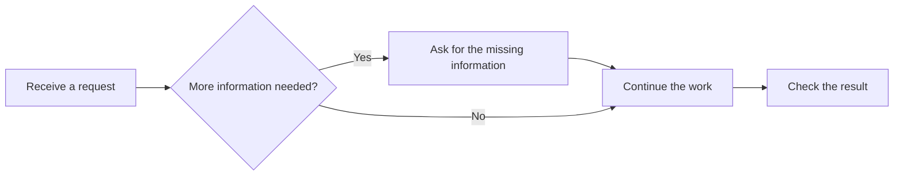

# Inline flow descriptions

## 阅读与选用策略（2026-10-08 确认）

流程说明直接留在原聊天消息中。先用简短文字说明结论、当前状态和影响判断的依据；当顺序、依赖、条件分支、并行或汇合用文字不容易讲清时，再附流程。简单问答继续用普通文字，图中的细节不能代替正文中的重要结果和缺口。

消息内先显示完整的横向缩略预览，让读者看到全部步骤、分支和连接；点击预览或“放大”后，在当前页面阅读同一流程，支持移动、缩放和查看节点详情，关闭后回到原消息。缩略预览负责看全貌，放大视图负责读细节，不能为了保持文字大小而截掉后半段流程。

新流程使用 `mermaid` 代码块和 `flowchart LR`。主线从左到右，分支分别展开，条件写在连线上，共用的汇合节点只保留一次，回路保留连接。节点写简短、具体的动作或对象，详细解释和来源放在配套文字或节点详情中。箭头表示真实的顺序、依赖或交接；条件下的不同路径与可以同时进行的工作应写清区别，不能因排版把并行工作画成先后执行。

这次确认保留原消息、来源、只读交互和已有输出规则，替代早期默认竖排、展开后才看到分支，以及横向只显示局部流程的方案。React Flow 是交互参考；实际沿用现有消息渲染入口。适用范围是支持该渲染器的 RemoteLab Web 信息流；其他消息载体沿用自身能力，用清楚的文字说明条件与路径。用户当次明确指定的载体和布局优先。

本页是流程展示策略的维护位置；[整体说明项目的图表约定](architecture-atlas/README.md#关系和信息流怎样画)继续约束内容组织和事实边界，[反馈记录](../notes/current/user-feedback-log.md#2026-10-08--preview-the-whole-flow-before-opening-it-for-reading)保留修订与确认过程。流程展示与任务验收、进展卡、提问和执行授权各自沿用原机制。

## Renderer and interaction contract

The Web conversation renders supported Mermaid `flowchart` or `graph` blocks inside the original message. The message shows a complete thumbnail of the connected left-to-right flow, fitted to its bounds without cutting off later steps. Parallel branches occupy separate lanes, conditions appear on arrowed connections, and shared endpoints appear once with all incoming arrows. Click the thumbnail or Expand to open a larger interactive view in the same page. Click a step there to inspect its full text and incoming/outgoing relationships, including return connections. “Original description” keeps the exact source and its copy button in the message.

For example:

The expanded view initially fits the entire flow. Drag with a mouse or scroll on touch/keyboard to follow it. Overview fits the complete structure; Read restores the text size. Branches brings the first split into view, and zoom controls retain the viewport center. Close, Escape or a backdrop click returns to the original message; keyboard focus returns to its Expand button. Same-source message rerenders keep the open viewer, zoom, position, selected step and source disclosure; removing the message closes its viewer. This is a read-only display: clicking a step does not select an answer or execute its contents. Rendering uses the existing message pipeline, without a separate page, raster image, framework, remote service, or additional model call. Existing messages gain the same display after loading the updated frontend.

Supported input includes `TD`, `TB`, `LR`, `RL`, and `BT` headers; standalone or referenced nodes; square, round, or decision labels; chained `-->`, `==>`, and `-.->` connections; and `|condition|` labels. Layout directions are accepted as source metadata; the display always runs left to right with explicit connections. DFS return edges are excluded only while ranking columns; they remain visible as dashed arrows. Longer connections route above the cards. A plain untagged code fence starting with a supported header also works. Other languages are never converted.

Incomplete streamed blocks, conflicting declarations, unsupported Mermaid syntax, or inputs over 30,000 characters, 64 nodes, or 128 edges remain ordinary code. The renderer never silently discards an unsupported line. Labels are inserted as text. Cards and connection labels limit long text to their available space; selecting the connected step shows the complete text and conditions. Source messages and durable history are not rewritten.

Implementation: `static/chat/inline-flow.js`, called by `renderMarkdownIntoNode` in `static/chat/ui.js`. Styles use the existing theme variables in `chat-messages.css`. The script is loaded in both the normal/shared template and the compatibility asset loader.
