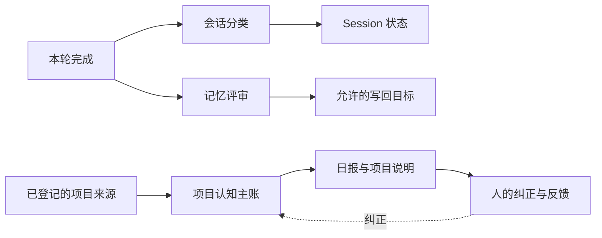
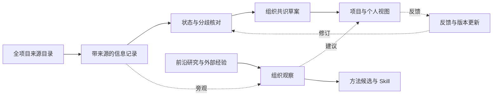

# RemoteLab 如何记住、理解与协作

<!-- Generated from guide-data.js by render-reference.mjs; edit the content source. -->

版本 1.0；核对日期 2026-10-03；运行源码 `d19adfa1`；主线基线 `a3c33eec`。主要读取与写回文件在两者间一致。

让 Agent 在多人、多项目、多信源的工作中形成可追溯、经相应职责认可的组织认识；从同一份认识生成项目与个人视图，持续发现进展、风险和值得复用的方法。

本页解释已经核实的读取与写回机制，并展示尚未实施的治理方案。图的连线表达读取、归集或派生关系；不表示每一轮都运行全部步骤。 未逐条复审全部历史业务事实；治理测试运行层尚未实施。

交互入口：[index.html](index.html)。真实人数通过网页按钮在登录后读当前实例，不保存真实名单或私人偏好。

## 开工读取

**入口与读取不同。** RemoteLab 在新原生线程提供记忆位置；Harness 决定本次需要读哪些正文。继续同一线程时，启动指针不会整包重新注入。

**实例与个人不同。** 本地 user memory 默认按机器或实例共用。Person 已保存部分产品设置与个人 Session 排列；协作偏好还缺逐人来源、适用范围和确认记录。

**候选与共识不同。** 自动提炼可以提供线索。候选有来源后还要核对适用范围、状态与确认职责，才能进入有效共识。

### 新线程首次开工

自动提供：启动指针、适用的本轮来源与约定。按需读取：项目索引、偏好、任务、Skill 和证据。第一次开工也没有强制全盘检索。

### 同线程继续

复用原生线程的已有上下文；本轮来源和适用约定继续投影。文件已更新不代表旧上下文自动消失；涉及当前状态仍要查证。

### 换 Harness／重建线程

重建启动指针，并在有可用历史时提供有界延续。RemoteLab 保留归一化历史；原生 Harness 没有返回的隐藏上下文不能被完整重建。

| 区域 | 何时提供或读取 | 用途 |
| --- | --- | --- |
| 当前请求 | 本轮输入 | 人的请求、附件和连接器来源分别保存。以本次目标为检索起点；群内一般讨论不自动构成执行授权。 |
| 启动指针 | 新线程自动提供 | system-prompt 提供路径与能力目录，并检查入口是否存在，不读取记忆正文。bootstrap 是小导航；projects 是领域路由；skills 是方法入口；共享 system.md 同样按需读。 |
| 原生线程延续 | 继续线程时复用 | RemoteLab 保存原生 resume 标识。Harness 负责自己的上下文管理与原生记忆。RemoteLab 的 Context 记录只能证明平台传了什么，不能证明 Harness 看见的全部内容。 |
| 有界历史交接 | 重建时有条件提供 | 没有可复用原生线程时，从可用历史或既有延续记录构造有界交接。workSummary 已存入会话元数据，但当前普通每轮前台不重新注入该短摘要。 |
| 本轮来源与约定 | 本轮自动投影 | 投影当前 Request 的来源信息、连接器上下文、显式 Session 约定和可用本地桥接状态。具体内容取决于来源与配置；没有这些内容时不会凭空补齐。 |
| Harness 解释任务 | 任务执行主体 | 选择读什么、怎样计划、如何用工具和验证结果，由当前 Harness 负责。治理测试层不能成为所有普通任务必须经过的第二个规划器。 |
| 按需检索知识 | 相关时读取 | 从索引进入相关文档或章节，再按需要查原始来源。项目主账与用户目录 projects.md 名字相似、职责不同。历史旁观信息和个人局部偏好不应升级成全局指令。 |
| 查当前业务证据 | 状态问题需核对 | 任务系统保存行动状态，训练或评测系统保存运行与结果。报告称完成、文件存在、任务卡完成和验收通过分别记录。没有日志不等于没有工作。 |
| 追溯历史依据 | 需要追溯才读 | 保留旧方案和失败依据，帮助解释变化。旧事实带日期与被替代关系，不作为当前默认规则。检索到一段话还要判断它适用于谁、何时、什么工作。 |

补充：Harness 自身的指令、工作区 AGENTS.md 和原生记忆有各自加载链路。连接器上下文由配置和来源决定；已出版日报只在配置的 Jev 路径选择有界片段。可选启动知识探测不等于本地记忆检索。RemoteLab Context 记录证明平台投影，工具读取记录才能证明本轮打开了正文。

## 收尾归集

### 当前机制

目前存在几条独立链路：会话组织、自动候选提炼、项目审阅与日报。它们尚未统一为逐条来源、版本和职责确认的组织认知层。

- **本轮完成（已运行）：** 正常轮次完成后触发后台处理。会话摘要、自动记忆评审、业务任务验收的目的不同。
- **会话分类（后台异步）：** 分类器整理 Session 的共享元数据和发起者的个人视图。它不继续任务，也不构成业务结果验收。
- **记忆评审（后台异步）：** 主要读取用户消息最多约 2000 字符、助手回答约 3000 字符。完整工具证据不直接输入；提炼后主要以短条目追加、按完全相同文本去重。
- **Session 状态（归类与恢复）：** 保存短摘要与个人会话排列。项目认识不能只依赖生成摘要；原始证据和业务系统仍需保持可达。
- **允许的写回目标（配置决定）：** 代码默认发现最多 24 个任务文档；配置按目标 ID 禁用或替换。在本次实例审计中仍有 3 个任务目标、用户 inbox 和系统候选目标；这不是只进 inbox。目标资格不等于内容已验收。 入口：`writeback-targets.json`、`reference/inbox.md`、`memory/auto-system-memory.md`、`tasks/（依配置）`。
- **已登记的项目来源（实例项目流程）：** 现有日报来源有明确白名单与排除范围，不能代表全组织覆盖。采集检查点、分页和失败记录属于本机项目审阅资料。
- **项目认知主账（人工与 Agent 维护）：** 将来源形成项目认识，保留改变结论的证据。用户目录的 projects.md 是导航；项目知识目录的 projects.md 是认知主账。 入口：`project-knowledge/projects.md`。
- **日报与项目说明（可读投影）：** 日报解释现有任务与结果，出版、正文读回、评论绑定和送达分别核验。一个发布成功回执不能证明所有读者已收到或认可。 入口：`project-knowledge/daily/`、`project-review/daily/`、`project-review/publication-receipts/`。
- **人的纠正与反馈（已有部分反馈链路）：** 已有评论处理与局部修订。对每个条目、每个版本分别绑定项目负责人、相关个人和验收人的确认，仍是待建设能力。

### 治理目标（未实施）

全项目信息先进入独立测试层。共识草案、项目视图和个人视图由同一批可追溯记录生成；职责确认和正式执行后续分步启用。

- **全项目来源目录（拟建设）：** 覆盖所有已登记项目。列清来源、读取授权、检查点、编辑/撤回能力、失败与排除理由。不可读就呈现缺口，不绕过边界也不标记完整。
- **带来源的信息记录（拟建设）：** 保留原出处、作者、发生时间、获知时间、项目/人员归属和版本；转发、日报与 Agent 摘要沿用来源谱系，不算多份独立佐证。
- **状态与分歧核对（拟建设）：** 用相应业务系统核对状态。新结论指明替代谁，保留旧版本和分歧；未知留待核。计划、开跑、产物和验收不可自动越级。
- **组织共识草案（测试先产出）：** 明确来源的普通事实可自动核对。范围与优先级由项目负责人确认，责任承诺由相关个人确认，交付结果由验收人确认；无回应不等于认可。
- **组织观察（拟建设）：** 观察真实工作流程、依赖与资源冲突。一次有价值的实践即可登记候选；方法推广另需真实独立复用。Agent 优先级建议附依据和反例，不改写人的排期承诺。
- **前沿研究与外部经验（后续接入）：** 优先读论文与官方材料；把建议连接到具体内部问题，列清适用条件、代价和最小验证。领域新闻不能直接证明内部方案有效。
- **项目与个人视图（测试日报先运行）：** 组织视图看全局与跨项目依赖；项目视图看目标、里程碑与验收；个人视图看责任、承诺和本人偏好。视图不各写一份互相冲突的主账。
- **反馈与版本更新（后续启用）：** 反馈回到对应条目及版本。实质修改后核对哪些确认失效、哪些报告需更新。用纠错速度、漏报率和实际复用收益检验优化。
- **方法候选与 Skill（分步启用）：** 优先核对已有流程，区别重复、分层复用与互补。活动 Skill 升级要有适用场景、验收、失败条件和真实复用结果。

## 各层区域与维护边界

| 层 | 范围与状态 | 入口 | 何时读／怎样写 |
| --- | --- | --- | --- |
| 启动与路由 | 实例；现有 | `bootstrap.md`、`projects.md`、`skills.md` | 新线程拿到指针；正文按需读；明确整理导航，不追加业务流水 |
| 会话工作上下文 | Session；现有 | `chat-history/`、`workSummary`、`原生 resume 标识`、`activeAgreements` | 继续原生线程，或有条件重建延续；运行事件与后台分类更新 |
| 本地偏好与环境 | 机器／实例；现有，范围待细化 | `model-context/preferences.md`、`reference/current/`、`reference/topics/` | 相关人物、主机或领域问题时；有依据地整理与标记旧结论 |
| 任务恢复笔记 | 任务／项目；现有 | `tasks/index.md`、`tasks/*.md` | 恢复具体工作和历史决定时；任务维护；当前后台也可能写入允许目标 |
| 平台共享经验 | 跨部署平台；现有 | `memory/system.md` | 平台问题相关时；稳定且跨部署适用的经验整理 |
| 自动记忆候选 | 用户／系统候选；现有，写入边界有缺口 | `reference/inbox.md`、`memory/auto-system-memory.md`、`writeback-targets.json` | 明确的治理与核验任务中；后台提炼，目标由代码与配置决定 |
| 项目认知与日报 | 跨项目；实例已有 | `project-knowledge/projects.md`、`project-knowledge/daily/` | 项目审阅与相关任务时；主账更新，日报做日期投影 |
| 审阅证据与反馈 | 来源／审阅轮次；实例已有 | `project-review/` | 覆盖核对、评论处理、出版验收时；来源检查点、局部修订与回执 |
| 操作方法与工作流 | 适用场景；已有 Skill；观察治理待启用 | `Skills`、`WORKFLOW`、`方法审阅记录` | 方法与当前任务匹配时；具体改善后用独立真实任务验证 |
| 原生记忆与历史 | Harness／历史；现有 | `Harness 自身记忆`、`archive/`、`原始来源` | 由 Harness 决定，或需要追溯时；按各自生命周期保留 |
| 组织共识与来源登记 | 组织；拟建设 | `组织来源目录`、`带版本认知记录`、`共识快照` | 后台全项目审阅；前台仅相关时；独立测试层先归集，确认后受控晋升 |
| 个人设置、协作偏好与项目关系 | Person × Project；产品设置已有；协作记录拟建设 | `Person.preferences`、`协作偏好记录`、`项目成员／职责关系` | 产品设置由界面使用；协作记录供相关个人或项目视图读取；本人设置或明确表达，区分默认值与确认；协作偏好附来源与范围 |

- **启动与路由：** 入口路径要能核实当前实例；索引只放最少定位信息。
- **会话工作上下文：** Context 事件记录 RemoteLab 的投影，不声称捕获 Harness 全部上下文。
- **本地偏好与环境：** 本地 user 层不等于当前 Person 的专属偏好；局部习惯不能覆盖整个组织。
- **任务恢复笔记：** 保留时间与来源；任务实际状态仍回查原系统。新增文件不应自然获得正式自动写入资格。
- **平台共享经验：** 排除个人授权、机密路径、某次事故残留和短期业务状态。
- **自动记忆候选：** 候选不自动成为正式规则；逐条补来源、适用范围和替代关系。
- **项目认知与日报：** 导航与认知主账分开；当前认识和历史变更分别可读。
- **审阅证据与反馈：** 来源读取、正文发布、送达、人的认可分别记录。
- **操作方法与工作流：** 第一次有用实践即可成为候选；发现方法和证明通用有效分别验收。
- **原生记忆与历史：** 历史事实不作为当前指令；来源权限变化要影响派生内容的可读范围。
- **组织共识与来源登记：** 显示覆盖缺口、分歧、证据与职责确认；不把生成摘要称为组织已认可。
- **个人设置、协作偏好与项目关系：** 已有 Session 筛选、语音快捷键和移动输入模式设置。规范化默认值不证明本人明确认可。项目和个人是多对多关系；Agent 不能凭同账号或转述认领偏好。

## 优先修正的缺口

- **写入边界：** 改成明确允许列表，并在执行层限制测试写入。先处理说明“只进 inbox”而新任务仍可自动写入的偏差。
- **逐条来源与版本：** 补作者、发生/获知时间、原始引用、状态、替代与冲突关系；避免助手总结再次被当成独立证据。
- **人物与项目归属：** 现有 Person 登记、产品设置与会话分类继续使用；补协作偏好的来源、范围和确认，以及项目成员职责；归属不明就待核。
- **全覆盖与观察：** 把来源覆盖、工作流漏报、重复建设与跨项目依赖纳入检验；零候选不能作为没有好经验的证据。
- **说明与运行一致：** 启动指针、当前源码、摘要注入和实际目标都需读回；旧设计、未启用配置和历史事故单独标记。

## 组织、项目与个人

项目和个人是多对多关系。组织共识、项目视图和个人视图从同一批带来源记录生成；任务、作业、结果与验收继续由相应系统维护。偏好需要本人来源与适用范围；未知就写未知。登记人数不等于去重后的组织人数或活跃用户数。

PMO 指跨项目协调与推进的职责。Agent 持续核对进展、发现遗漏和依赖、比较重复工作、提取好方法并提出建议。人确认目标与取舍、自己的承诺和现实验收。没有日志不等于没有工作；进度百分比必须有明确里程碑、分母和验收依据。

| 信息字段 | 保存什么 |
| --- | --- |
| 性质 | 事实、口头报告、计划、承诺、结果、决定、Agent 判断、方法候选 |
| 归属 | 项目与人员 ID；作者、提出人、执行者、记录者分别记录 |
| 来源 | 原始引用与版本；转述沿同一来源谱系 |
| 时间 | 发生时间、获知时间、生效及失效时间 |
| 状态 | 业务执行状态、证据程度、确认状态分别维护 |
| 版本与传播 | 版本、替代/冲突关系、职责确认、受影响视图与报告 |
| 可见范围 | 来源权限与派生内容一致；公开说明不包含真实名单或私人偏好 |

| 确认职责 | 确认内容 |
| --- | --- |
| 项目负责人 | 目标、范围、优先级与跨项目依赖取舍 |
| 相关个人 | 本人责任、时间与交付承诺，以及本人偏好 |
| 验收人 | 标准与实际交付结果的验收 |

确认绑定条目版本。实质修改后，相关确认重新核对；无回应不等于认可。明确的普通事实可以自动查证，不要求所有人逐条点击。工作流发现允许一例有用实践，活动 Skill 晋升另需真实独立复用证据。

## 落地顺序与验收

### 全覆盖测试

全部已登记项目：来源归集、归属核对、状态分歧、组织观察、测试日报。

新职责确认、个人外部推送、任务写入、业务执行、Skill 晋升与正式记忆写回暂时关闭。

验收：来源目录逐项说明已读、部分、不可读和排除；重放不重复，旧结论可追溯；测试无法污染正式记忆。

### 确认与反馈

按事项性质和职责确认版本；项目、个人视图回收纠正。

明确事实不要求所有人逐条点击；无回应不自动通过；新版本不能沿用已失效确认。

验收：对责任、范围和验收分别确认；纠正能传到受影响条目与视图，人的负担可接受。

### 受控进入正式协作

验收通过后逐项启用正式更新、方法推广和获授权的行动。

不增加所有普通任务必经的隐藏规划器，不凭建议改人的排期。

验收：相对原流程，事实错误与漏报减少、纠错更快、方法有真实复用收益，前台成功率与延迟不退化。

### 持续优化

新来源、真实失败、意见分歧和方法复用提供下一轮优化线索。

不按文档篇数、记忆大小或日报数量判断治理成功。

验收：每轮记录目标、改动、收益、代价和仍未知事项；以实际协作效果决定保留、修订或撤回。

### 测试隔离

测试有独立存储、游标、索引、原生线程和记忆状态；服务端识别测试用途并跳过正式自动写回。写入限制由代码/权限保证，不能只靠提示词。复用现有读取能力，不启动第二个群消费者或 chat 控制面。并发、CPU、IO 和 token 有独立预算；前台不增加必经模型调用或全量记忆注入，观察到退化就暂停测试消费。上述隔离是实施要求，本页未部署该测试运行层。

| 最终效果 | 评估内容 |
| --- | --- |
| 认识是否准确 | 来源覆盖、归属错配、事实错误、状态越级、过期结论与纠正传播时间 |
| 观察是否有用 | 工作流漏报和误报、重复工作判断准确性、跨项目依赖发现、建议被采纳及其结果 |
| 协作是否更省力 | 职责确认负担、无效打扰、交接与复用收益、前台任务成功率、延迟和资源成本 |

## 当前依据

- [启动上下文](../../chat/system-prompt.mjs)：确认只提供位置与能力，不读取记忆正文。
- [首轮、续接与收尾入口](../../chat/session-manager.mjs)：确认 fresh/resume、逐轮投影与后台写回调用。
- [本轮上下文](../../chat/turn-context-hook.mjs)：来源、桥接和显式约定；短摘要不普通每轮重注入。
- [连接器 Context 契约](../../docs/connector-turn-context.md)：Request 来源快照和投影可观察范围。
- [有界延续](../../chat/session-continuation.mjs)：历史选择与截断。
- [会话状态投影](../../chat/session-control-state.mjs)：workSummary 的保存与延续关系。
- [后台会话分类](../../chat/session-state-classifier.mjs)：会话组织与业务验收的区别。
- [个人 Session 视图](../../chat/session-person-view.mjs)：视图归类不等于个人记忆或访问隔离。
- [已有个人产品设置](../../lib/auth-config.mjs)：Person.preferences 的保存与默认值规范化；不等于完整的协作偏好库。
- [写回目标发现](../../chat/memory-writeback-targets.mjs)：任务发现、禁用配置与候选目标。
- [自动记忆提炼](../../chat/session-memory-writeback.mjs)：输入范围、追加与文本去重。
- [记忆激活边界](../../notes/current/memory-activation-architecture.md)：指针与正文、存储与使用分开。
- [控制面与 Harness 分工](../../notes/current/thin-control-plane-architecture.md)：保持 Harness 对普通任务的解释与执行权。
- [已出版日报的条件式读取](../../docs/feishu-daily-report-memory.md)：仅配置的 Jev 路径读取有回执和 hash 的有界日报片段，不代表每个 Session 都读日报。
- [可选启动知识探测](../../docs/session-start-preflight.md)：它不是本地记忆检索或权限验收；本次实例配置未启用。

## 外部参考

- [LangGraph：记忆范围与后台整理](https://docs.langchain.com/oss/python/concepts/memory)：借鉴会话和长期知识分开、组织/个人命名空间；保留现有 Harness。
- [Zep：有时间范围的事实](https://help.getzep.com/facts)：记录获知、生效、失效与来源；有来源或模型提取不等于验收。
- [Letta：用途明确的记忆块](https://docs.letta.com/v1-sdk/memory/memory-blocks)：借鉴明确用途、容量与只读边界；按需激活相关内容。
- [Microsoft：事件记录与派生视图](https://learn.microsoft.com/en-us/azure/architecture/patterns/event-sourcing)：关键认知更正与确认保留历史；仅在有收益的部分采用，不全系统迁移。

## 维护

- guide-data.js 是本说明的内容源；网页与 Agent 参考 Markdown 使用同一份内容。
- 改读取/写回入口、来源范围或 Person 模型时，同步更新状态与依据；旧方案明确标记为历史或未实施。
- 本机审计证据、真实用户与偏好留在认证实例；共享文档只描述架构和经过脱敏的示例。
- 用真实问题验证治理效果，并记录仍未证明的部分；这份说明会随目标和实现继续修订。

编辑 `guide-data.js` 后运行 `node docs/memory-architecture/render-reference.mjs`；用 `--check` 检查参考文本是否同步。发布仅包括 `index.html`、`style.css`、`app.js`、`guide-data.js` 和 `README.md`。
