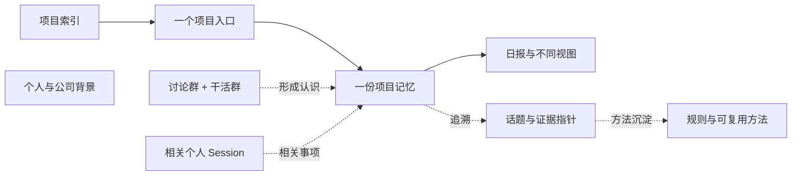
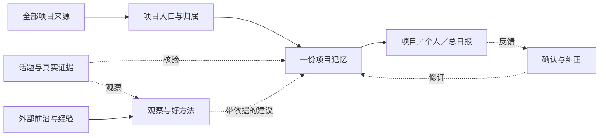
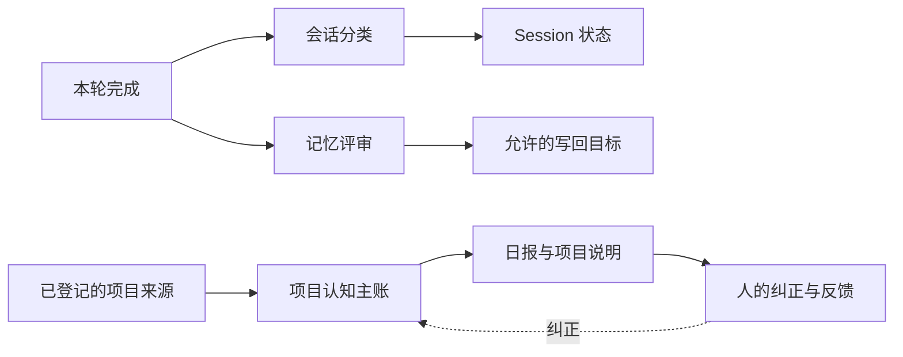
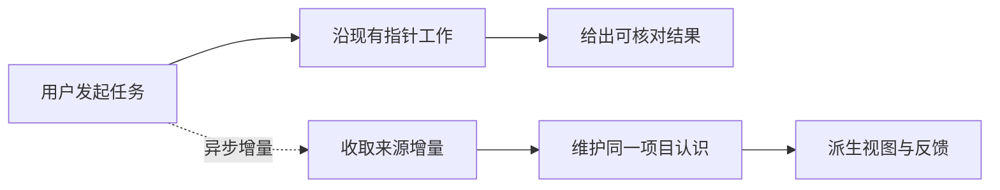

# RemoteLab 记忆治理：从一次工作到项目共识

<!-- Generated from guide-data.js by render-reference.mjs; edit the content source. -->

版本 2.7；核对日期 2026-10-03；运行源码 `751388fc（冻结旧运行版）`；主线基线 `0ef09dc2`。旧版已冻结；项目钩子新增指针投影，其余正文读取仍由 Harness 选择。实际部署版本以实例 build-info 为准。

让 Agent 在多人、多项目、多信源的工作中形成可追溯、经相应职责认可的组织认识；从同一份认识生成项目与个人视图，持续发现进展、风险和值得复用的方法。

2026-10-03 按用户要求沿原链路全范围接入项目记忆增强：匹配来源／明确 Session 的开工指针、同一主账的项目索引和原日报增强规则；已冻结旧版并保留总开关与分项开关。登记范围不等于全组织已完整覆盖，运行配置不等于人的认可。真实回复质量、速度与成本继续从实际使用确认。网页案例均为虚构，不展示真实人员、群 ID、公司地址或聊天正文。 未逐条复审全部历史业务事实；运行接入和实际效果、人按职责认可分别验收。

本章属于 [RemoteLab 整体说明项目](../architecture-atlas/README.md)，统一目录和发布规则在该项目维护。交互入口：[index.html](index.html)。真实人数通过网页按钮在登录后读当前实例，不保存真实名单或私人偏好。

## 方案骨架

**一份项目记忆，多种信源。** 讨论群、干活群和相关个人 Session 共同供给一个项目；话题和原始证据通过指针关联。

**按用途存，按任务读。** 项目认识、话题约定、个人偏好、公司事实和操作规则各有维护位置。目录提供导航，内容按本次任务读取。

**日报回收反馈，共识回到原处。** 项目日报、个人视图和组织日报从项目记忆派生。人的确认与纠正更新原条目及版本。

- **项目索引（导航）：** 保留现有 projects.md 导航。范围登记表保存群与项目的绑定，导航从它生成；索引不再复制推进状态。 入口：`~/.remotelab/memory/projects.md`、`已接入：记忆目录/project-runtime.json`。
- **一个项目入口（范围明确）：** 一个稳定 projectId 对应一个项目入口。讨论群和干活群属于同一项目；项目成员、职责、相关话题与记忆指针在这里可定位。
- **一份项目记忆（唯一认知主账）：** 先沿用 project-knowledge/projects.md 的项目章节，加入稳定条目 ID 和来源、时间、版本、确认属性。文件变大后可以拆分项目文件，旧入口保留跳转；不同时维护两份主账。 入口：`project-knowledge/projects.md#项目章节`。
- **日报与不同视图（派生与反馈）：** 组织汇总直接读取项目主账的同一版本。项目日报和个人视图只是筛选与解释；不要求先复制一遍项目日报再汇总一遍。反馈回到条目 ID 与版本。
- **讨论群 + 干活群（项目的来源）：** 原文留在飞书及现有连接器记录。近期跨群片段帮助当前对话，持久项目认识则进入项目主账；两者职责不同。
- **相关个人 Session（项目的来源）：** 明确涉及该项目的决定、承诺、结果和方法可以进入候选。记录归属依据与原始消息；项目关联不等于全部对话都应共享进项目。
- **话题与证据指针（细节留在原处）：** Session 事件保存过程；activeAgreements 保存当前局部约定。需要长材料时才建立任务笔记。项目条目链接到具体消息、章节、提交或结果；完整验收仍由业务系统维护。
- **个人与公司背景（相关时读取）：** 个人写作偏好只影响相应人的任务，公司位置只在就餐、出行等场景读取。它们与项目记忆并列维护，通过用途和身份选择，不自动变成全局规则。
- **规则与可复用方法（相关时读取）：** AGENTS.md 放所在工作区或仓库的稳定操作约束；Skill 放可重复执行的方法。项目观察先记录为方法候选，有独立复用证据后再完善 Skill。

- **骨架保持简单：** 项目索引 → 项目入口 → 项目记忆与相关话题／证据指针。来源、时间、确认与版本是条目的属性，不各自新造一层记忆。
- **群确定范围，项目拥有共识：** 用稳定 projectId 绑定讨论群与干活群。群更名不改变项目身份；两个群的同一事项归到同一项目条目。
- **个人工作能贡献项目认识：** Session 有本次工作的归属，但其中的信息逐条归属。一个跨项目 Session 可以给多个项目贡献不同条目；个人闲聊不会整包进入项目主账。
- **背景与方法按需引用：** 个人偏好、公司信息、AGENTS.md 和 Skill 是不同用途的旁路。与当前任务匹配时读取，项目文件不再复制它们的全文。
- **全范围增强，真实使用后调优：** 沿用原项目主账与既有日报，覆盖全部已登记节点。先冻结旧版，再全范围使用；原始证据、人按职责反馈、实际任务结果分别验证，离线同题对照作为诊断。

## 存储地图：现状与方案

配置目录默认 `~/.config/remotelab`，记忆目录默认 `~/.remotelab/memory`；实例环境变量可覆盖。连接器 `storageDir` 由其配置决定，`project-knowledge/` 为独立项目知识目录。Session ID 为稳定身份。Harness 原生会话／记忆在运行配置选定的 provider home，平台保存恢复标识；平台事件不等于全部原生上下文。

### 一个 Session：这次对话与执行过程存在哪里？

**目前实际存储**

入口：`配置目录/chat-sessions.json`、`配置目录/chat-history/<sessionId>/events/*.json`、`配置目录/chat-history/<sessionId>/bodies/*.txt`、`配置目录/chat-runs/<runId>/`。

元数据保存原生恢复标识、workSummary、personViews 等；events 保存归一化事件，大正文可外置到 bodies。原始 Run、工具执行和 Harness 原生上下文各有存储，不等于同一份完整记录。context.json、fork-context.json 仅在相应流程产生，不是每个 Session 都有。

读取：继续同一原生线程时复用上下文；重建时可从可用事件形成有界交接。查历史事实时定位到具体事件并读取正文。

写入：平台保存事件，后台分类器整理共享摘要与个人侧栏。摘要和侧栏分组均不证明项目归属或结果已经验收。

**治理方案（分项实施）**

入口：`沿用现有 Session 事件与 Run 存储`、`已接入：记忆目录/project-runtime.json 的明确 Session 关联`。

不为每个 Session 再造一本项目主账。登记默认项目及归属依据，项目条目引用 sessionId + 事件序号。跨项目工作按事项分别关联；不明确的关联保留待核。

读取：先查本次请求的项目归属，再进入相应项目章节和话题依据。项目状态需要时核对当前业务证据。

写入：原文仍在原处；与项目有关的认识写入该项目章节。个人偏好写入相应个人记录，操作过程留在事件中。

### 一个群 / 两个群：群消息和“群记忆”分别在哪里？

**目前实际存储**

入口：`飞书原始群消息与文档`、`连接器 storageDir/events.jsonl`、`连接器 storageDir/connector-message-index.json`、`连接器 storageDir/project-message-streams/<项目 hash>.jsonl`、`已提交 Request 的 sourceContext 与 Context 事件`。

连接器日志记录其接收到的来源，索引用于消息／话题与 Session 绑定。已配置项目对有一个较小的跨群消息流；文字每条最多 900 字符，供近期上下文使用。它不是完整聊天档案或经确认的群共识。未接收到的消息、不可读附件和被截断正文需要另外核对。

读取：跨群输入当前按 24 小时、最多 20 条、总计 6000 字符选择；讨论→干活是默认方向，反向需明确配置。它不是语义检索。

写入：现有消费者保存来源和投递回执；本次核实 bot-2 配置有一对项目群。其他来源覆盖不能由这一对推断。

**治理方案（分项实施）**

入口：`同一个 projectId 的项目记忆`、`已接入：记忆目录/project-runtime.json 的精确来源群关联`、`原始消息沿用现有来源存储`。

群是信源和范围锚点。两群共同维护一份项目共识，不各写一份群主账。群内新话题保留局部约定，项目级约定才进入项目记忆。

读取：从群绑定直接定位项目入口，读取该项目的有效认识，再按话题补相关消息或证据。

写入：接入已存在的群采集／散落讨论处理结果和覆盖回执，不启动第二个消费者。编辑、撤回、缺页及无权限来源要标记。

### 一个话题：话题约定会不会影响整个项目？

**目前实际存储**

入口：`Session.activeAgreements（chat-sessions.json 内）`、`Session 事件与来源快照`、`已有 ~/.remotelab/memory/tasks/ 任务笔记`。

activeAgreements 本轮可投影，但最多 6 条、每条 240 字符；它承载局部生效约定，不是完整知识库。更长材料应保留正文和指针。

读取：同话题执行读取有效局部约定与当前工作依据；历史方案需要追溯时再读。

写入：当前明确的约定及原讨论保留在该 Session。已有任务笔记并非自动一 Session 一文件。

**治理方案（分项实施）**

入口：`沿用 activeAgreements 与 Session 事件`、`必要时：~/.remotelab/memory/tasks/<sessionId>.md`、`项目记忆中的话题指针`。

话题可以有自己的方法、临时目标与条件。只有影响整个项目、被相应职责确认的内容才晋升项目约定。长任务笔记按需要建，不给每个新话题增加空文档。

读取：开新话题读取项目有效约定；只读与新任务有关的旧话题，不继承其他话题的临时限制。

写入：局部更新仍在局部位置，项目入口更新相关指针。推广为项目约定时记录生效范围、依据与替代关系。

### 一个项目：我们认可的推进情况以哪里为准？

**目前实际存储**

入口：`~/.remotelab/memory/projects.md（导航）`、`project-knowledge/project-index.md（项目章节索引）`、`project-knowledge/projects.md（认知主账）`、`project-knowledge/daily/YYYY-MM-DD.md（日期视图）`、`project-review/（来源、检查点与出版回执）`。

同名 projects.md 有两个职责：一个带路，一个记录认识。项目认知不包含宿主机凭据、调度配置或原始聊天导出。现有日报来源有边界，尚不证明全组织覆盖。 项目索引和运行关联已接入，普通已核实事实继续沿原主账更新，关键职责与验收通过原日报反馈核对。

读取：相关项目工作读主账相应章节；审阅与纠错再查来源索引、原文和真实结果。

写入：现有项目流程增量维护主账及日报。逐条版本、归属和职责确认仍需建设。

**治理方案（分项实施）**

入口：`同一 project-knowledge/projects.md 的项目章节`、`已接入：记忆目录/project-runtime.json（开关及导航关联）`、`同一主账派生的日报和个人视图`。

初期直接在现有项目章节中维护稳定条目：目标、有效决定、推进情况、依赖、未决问题与组织观察。每条有来源和版本。先不增加平行数据库或单独的“组织共识主账”。

读取：读项目当前有效认识及相关条目；有疑问再沿指针查对应话题、原文或结果。

写入：Agent 可整理、查证和提出修订。负责人确认范围与优先级，个人确认本人承诺，验收人确认实际结果。组织共识是这些项目认识的组合视图。

### 个人偏好：怎么保留合作中的个人特点？

**目前实际存储**

入口：`~/.remotelab/memory/reference/people/<personId>.md`、`~/.remotelab/memory/reference/people/index.md`、`配置目录/auth.json 的 Person.preferences`、`~/.remotelab/memory/model-context/preferences.md`、`Session.personViews`。

Person.preferences 已有输入模式、语音快捷键等产品设置。旧 preferences.md 曾按机器／实例维护且混合了多种范围；现为历史导航，原正文完整归档，不能当作每个人的偏好。personViews 是侧栏排列；默认值也不等于本人明确表达。 2026-10-03已核真实Person并登记一项本人明确称呼偏好，bootstrap提供按需入口；机器共用旧personal/identity.md不代表所有同事。

读取：产品设置由界面使用；本轮已核消息身份提供对应Person档案指针，Harness在称呼、写作或协作需要时读取。文件存在与内容不会被指针自动认证；身份不清不继承Session创建者或其他人员档案。

写入：本人设置与已有人工维护；本轮开始按真实Person登记明确偏好，未完成全员归类，也未新增自动学习偏好机制。

**治理方案（分项实施）**

入口：`~/.remotelab/memory/reference/people/<personId>.md`、`产品设置继续在 Person.preferences`。

记录本人明确表达的写作、沟通、工作习惯和适用条件，保留来源与生效时间。根据已核对的 Person／外部身份选择；多人共用账号、机器用户名或 Session 创建者都不能自动代表每条消息的作者。

读取：本次协作确实涉及该人的偏好时读对应记录，不加载全员偏好。群输出使用已认可的群／项目要求。

写入：本人明确的修改可更新偏好；转述或 Agent 推断先作为待核候选。一次“这篇写短些”默认只约束本次任务。

### 公司信息：办公位置、时区等公共背景放哪里？

**目前实际存储**

入口：`~/.remotelab/memory/reference/company.md`、`bootstrap.md 的按需背景指针`。

2026-10-03已按用户提供的办公楼和有来源的外部资料补入公司公共背景，区分稳定办公事实、待核周边线索、团队常去名单与实时路线。公开网页不打包这些私人正文。

读取：就餐、接待、办公室周边或出行相关时读取；营业、步行路径和公交方案按当次时间查询。

写入：用户补充与可靠来源明确区分；缺失餐厅名单或集合点保持未知，不从一次群聊猜全公司习惯。

**治理方案（分项实施）**

入口：`~/.remotelab/memory/reference/company.md`。

维护公司公开名称、时区、办公室／集合点、常用场地及适用时间。事实与组织制度分开；联系人、门禁与精确敏感位置按已有实例边界保存，不进入公开说明或共享源码。

读取：就餐、出行、访客接待和会议安排相关时读取。普通代码任务不需要公司地址。

写入：指定维护人或可靠原始资料更新，记录来源与更新时间；办公地点变化使旧条目失效。实际信息仍待补全，本页只有字段方案。

### AGENTS.md：哪些记忆可以成为 Agent 的操作规则？

**目前实际存储**

入口：`工作区 AGENTS.md`、`仓库及子目录 AGENTS.md`、`Harness 自身的加载规则`。

本项目使用 AGENTS.md 作为仓库内 AI 操作说明。它可以约束相关目录的编辑、验证与交付；具体加载由 Harness 决定，RemoteLab 的启动指针不证明它已被读取。

读取：进入相应工作区或仓库时按 Harness 规则加载；必要时明确查相关文件。

写入：维护仓库规则时审阅并走其版本控制流程。自动记忆候选不等于批准修改指令文件。

**治理方案（分项实施）**

入口：`沿用相应范围的 AGENTS.md`、`深层知识通过指针引用`。

适合存：稳定操作约束、项目维护入口、验证和交付规则。项目状态、个人口味、公司地址、聊天原文与一次事故排障均回到各自维护位置。规则明确适用范围与出处，不能把事实或讨论当成操作授权。

读取：工作区／仓库相关时加载稳定规则，沿指针按需读深层文档。AGENTS.md 不承载全组织业务记忆。

写入：跨任务稳定、范围明确、已经认可的操作要求才整理为规则；项目要求先进入该项目适用的说明，不因有用就晋升工作区通用规则。这里把你说的 agent.md 按现有 AGENTS.md 理解；普通同名文件不会自动获得加载能力。

### 经验 / Skill：好的工作流在哪里被发现和沉淀？

**目前实际存储**

入口：`现有 Skills 与 WORKFLOW`、`项目原始讨论和真实执行记录`。

已有可调用方法，但组织内有价值的实践未必进入了方法目录。没有候选记录不能推出没有优秀流程。

读取：遇到相关任务读取已有 Skill／WORKFLOW，再查真实案例。

写入：沿当前方法维护流程修订；执行记录本身不自动变成通用 Skill。

**治理方案（分项实施）**

入口：`项目记忆中的方法候选条目`、`经验证的现有 Skill／WORKFLOW`。

巡检时就记录有用案例、适用问题、步骤、收益、前提与反例，链接原始执行。涉及多个项目时保持一个案例身份，相关项目用指针引用。

读取：先比较现有方法，检查是否重复或互补；任务匹配时复用。

写入：一次真实有用实践可成为候选。独立复用证明适用性后再完善 Skill，并记录失败条件；不要求等到方法成熟才发现它。

### 自动候选 / 历史：提炼出来就会立刻影响新 Session 吗？

**目前实际存储**

入口：`~/.remotelab/memory/reference/inbox.md（本实例用户候选）`、`源码 memory/auto-system-memory.md（系统候选）`、`writeback-targets.json 与其实际目标目录`、`原始来源与历史版本`。

当前目录仍允许 3 个任务目标，以及用户和系统候选目标。后台评审主要看截断的用户／助手文本，不含完整工具证据；按相同文本去重。不能把“只进 inbox”的说明当作已经强制执行的边界。

读取：治理或追溯时读取候选；不作为无条件生效指令。

写入：由现有代码和实例配置决定。本次没有调整这些运行目标。

**治理方案（分项实施）**

入口：`隔离测试根目录中的候选、检查点与测试主账`、`正式内容仍回到相应项目／个人／公司／方法位置`。

提炼只是候选。分类、归属、来源核验与必要确认后，写入唯一维护位置；旧版本保留替代关系。新测试层用代码和写入权限阻止污染正式记忆，不能只靠“请勿写回”的提示。

读取：工作任务读当前有效内容；候选与旧版本在明确需要核验或追溯时读取。

写入：写入边界改成明确允许列表；测试不会写正式 AGENTS.md、偏好、项目主账或活动 Skill。来源更正／撤回要传到派生条目和视图。

## 项目归属规则（已接入导航，未知关联待核）

## 文件命名、实际位置和分档纠错

[原阅读页的完整文件地图](../architecture-atlas/output/index.html#memory-files)与本表来自同一内容源；登录该页14可读本实例文件名、绝对路径和当前有效写回目标。

| 区域 | 文件名 | 位置 | 内容 | 维护边界 |
| --- | --- | --- | --- | --- |
| 规则 | AGENTS.md | 工作区/AGENTS.md；项目仓库/AGENTS.md；适用子目录/AGENTS.md | 共同操作要求与简短入口；如保存已有工作、验证、交付、按身份读取人员区。 | 已认可且作用于该目录的共同规则由人或获授权Agent维护。个人称呼、写作口味、办公地址和业务进度均不进入。 |
| 规则 | system.md | 源码仓库/memory/system.md | 跨实例可复用的RemoteLab平台知识；不等于AGENTS，也不等于员工档案。 | 人工审阅跨部署适用性后维护；单个公司的偏好和机器故障记录不直接推广。 |
| 导航 | bootstrap.md | 记忆目录/bootstrap.md | 新线程得到路径；Harness按需读的小型开工入口。 | 只保留索引和稳定定位，不装全员档案或完整项目正文。 |
| 导航 | projects.md | 记忆目录/projects.md | 旧领域与任务的指针目录；与项目主账同名、路径不同。 | 按问题定位主题或任务；项目状态以项目知识目录的原主账为准。 |
| 导航 | skills.md | 记忆目录/skills.md | 方法与Skill入口。 | 路由到现行Skill，不复制操作全文或项目状态。 |
| 导航 | memory-layout.md | 记忆目录/reference/memory-layout.md | 实例分层、归档和读取边界。 | 治理更新；历史目录与现行入口明确分开。 |
| 人员 | index.md | 记忆目录/reference/people/index.md | 人员档案入口及身份读取规则。 | Person来自当前消息身份或明确核实的同事；缺档不等于无偏好。 |
| 人员 | <personId>.md | 记忆目录/reference/people/<personId>.md | 这个人的称呼、写作、协作习惯、适用范围、本人来源与变更日期。 | 本人明确表达可更新原条；转述、推断和身份不清先待核；只对该人适用。当前用一个档案，不再嵌套每人一份preferences.md。 |
| 人员 | auth.json → Person.preferences | 配置目录/auth.json | 真实Person/identity映射及产品设置，如输入模式、语音快捷键。 | 由产品身份与设置流程维护；默认值不是本人表态。不把自然语言偏好或凭据复制到公开说明。 |
| 背景 | company.md | 记忆目录/reference/company.md | 办公地点、公共出行入口、团队确认的常用地点与来源。 | 相关话题按需读；个人忌口归本人，餐厅营业和实际路线行动前查询。 |
| 背景 | hosts.md；robodojo-platform.md | 记忆目录/reference/current/ | 主机与评测平台当前事实入口。 | 事实修改需核当前部署/API；不把旧记录的机器状态当实时状态。 |
| 背景 | advisor.md；evaluation.md；foundation-model-training.md；remotelab.md；robotics.md；tools.md；training.md；work-management.md | 记忆目录/reference/topics/ | 已有领域资料、局部约定和方法背景。 | 只在命中领域时读；有来源和适用范围。旧“用户要求”未核Person前不转成全员偏好。 |
| 任务 | index.md；<任务名>.md；daily-unresolved-feishu.json | 记忆目录/tasks/ | 任务入口、局部决定、恢复资料和未处理事项。 | 先核真正任务/Run/验收系统；新建任务文件不会因文件存在自动获得记忆写回权限。登录清单列出实际任务文件名。 |
| 项目 | project-runtime.json | 记忆目录/project-runtime.json | 项目、群与明确Session的关联及开关、索引/主账/审阅规则路径。 | 精确来源或显式绑定；侧栏分组、标题相似和提到某项目不足以挂靠。 |
| 项目 | project-index.md；projects.md | 项目知识目录/project-index.md；项目知识目录/projects.md | 索引与唯一项目认识主账，讨论群、干活群和相关个人工作供给同一认识。 | 原链路增量更新，事实/承诺/验收/观察分开；稳定事项及引用连回来源。 |
| 项目 | <YYYY-MM-DD>.md | 项目知识目录/daily/<YYYY-MM-DD>.md | 项目、个人和总日报的日期投影。 | 从同一原认识生成；人的反馈回原事项，不另起竞争主账。 |
| 项目 | workflow.md；chronology.json | 项目审阅目录/project-memory/releases/<release>/ | 当前审阅规则与来源受限的时间线视图。 | 配置指向当前release；时间线核主账版本、时间类型及前序关系。冻结旧release不随意覆盖。 |
| 项目 | <YYYY-MM-DD>.sources.md；<来源快照> | 项目审阅目录/daily/；项目审阅目录/project-memory/releases/<release>/source-snapshots/ | 来源覆盖、失败、原文证据与不可变历史快照。 | 保存实际读到/未读到的边界；记录时间、事件时间和整理时间分开。 |
| 候选 | inbox.md | 记忆目录/reference/inbox.md | 自动提取的本实例待核信息，允许个人偏好候选。 | 不是默认规则或人员认可。新写回保留Session/Run/用户事件序号/录入时间；从原消息核作者，旧无来源条目不补造身份。 |
| 候选 | auto-system-memory.md | 源码仓库/memory/auto-system-memory.md | 自动提取的跨部署平台候选。 | 不收个人preference类别；内容误标仍有语义风险，人工审阅才进正式system.md，不直接升级AGENTS。 |
| 候选 | writeback-targets.json | 记忆目录/writeback-targets.json | 自动写回目标配置。 | 本实例allowedTargetIds仅允许user_auto_memory和system_auto_memory；实际用户目标是inbox。目标类别同时校验；允许列表之外的新任务被拒绝。其他实例配置需另核。 |
| 来源 | chat-sessions.json；meta.json；context.json；fork-context.json | 配置目录/chat-sessions.json；配置目录/chat-history/<sessionId>/ | Session元数据、历史索引和续接/分支上下文。 | 平台保存过程；Session总结与侧栏不等于项目共识，也不证明谁是本轮作者。 |
| 来源 | <seq>.json；<ref>.txt | 配置目录/chat-history/<sessionId>/events/；同Session的bodies/ | 消息与执行事件及正文；本实例Session事件按JSON文件保存。 | 原始过程按时间和序号可追溯；继续原生线程可能仍含旧上下文。 |
| 来源 | manifest.json；status.json；result.json；spool.jsonl；artifacts/ | 配置目录/chat-runs/<runId>/ | 单次运行配置、状态、结果、输出流和工具产物。 | Run结束不等于任务完成；原生provider home从对应运行配置核实，不凭Unix用户名猜。 |
| 来源 | events.jsonl；connector-message-index.json；<项目hash>.jsonl | 连接器storageDir/；其project-message-streams/ | 群原文事件、消息索引和项目关联消息流。 | 两个群可供给同一项目；关联文本有限额，不保证全群历史已语义检索。登录后显示已登记storageDir，不重新启动采集器。 |
| 历史 | preferences.md | 记忆目录/model-context/preferences.md → 记忆目录/archive/people-boundary-20261003/preferences.md | 你记得的旧Preferences文件。现行文件保留历史导航，原混合正文已完整归档。 | 旧版机器级入口混合公共规则、局部约定和未核人的倾向；不作为全员偏好、不批量归给当前人。 |
| 历史 | auto-user-memory.md；global.md；automation.md | 记忆目录/model-context/auto-user-memory.md；记忆目录/global.md；记忆目录/automation.md | 旧索引与历史路由。auto-user-memory这个默认文件名已被本实例写回配置替换为inbox。 | 文件还存在不等于仍接收自动写入。只追溯原文，不恢复旧自动化授权或过期能力。 |
| 历史 | identity.md；migration-manifest.json；progress-tracker.md；group-eval-submissions.md | 记忆目录/reference/personal/identity.md；reference/topics/migration-manifest.json；model-context/ | 旧共享身份、迁移出处和领域跟踪资料。 | 旧身份不是当前Person；跟踪记录不是实时状态。归档在archive/<批次>/，原文保留但不自动成为新规则。 |
| 原生 | AGENTS.md；MEMORY.md；memory_summary.md；原生会话/Skills | Harness运行配置选定的provider home；Codex常见于CODEX_HOME下 | Harness自身指令、检索记忆、压缩摘要、会话与方法；独立于RemoteLab人员区。 | 由Harness控制加载。本次未批量改写原生记忆；其中旧路径/个人表述可能残留，发现后以已核Person和当前原档案纠正。平台指针不能抹除已加载上下文。 |

第一次把个人称呼写进公共AGENTS，是人工把“长期需要记住”误当成“所有Session共同规则”。后来虽建立人员档案，我又保留了“全局兼容”副本；这是错误的例外，让个人正文和公共入口并存。本轮自动写回器不能直接写AGENTS，这次并非它自动分到了AGENTS。

个人正文只维护在对应Person档案；公共AGENTS保留读取入口。当前消息Person/identity匹配后投影该人的路径。旧preferences入口改为历史导航，原文完整归档；旧共享identity明确不代表当前作者。

仍有可能：Agent有手动文件编辑能力，语义可能判断错；原生旧线程或Harness记忆可能保留过时内容。我们缩小自动写入口、校验目标与类别、保留出处、纠正原条并核新一轮读取；没有宣称操作系统已经禁止所有人工错写。

- **旧偏好误套给全员**：旧preferences曾以“用户”泛称多种来源，旧identity只有一个机器共用身份。 退出默认偏好入口；归档保真，未核身份保持待核，不给每个员工复制一份。
- **自动写入新任务**：旧配置只禁用了当时已知任务ID，新建的三份笔记仍出现在有效写回目录。 改为显式目标允许列表；用新增任务、额外目标与空列表做拒绝测试，配置之后再核实际目录。
- **个人偏好进入跨部署候选**：过去目标categories只有提示作用。 代码校验目标类别并拒绝system+preference；误标workflow仍需内容审阅，不能证明绝无语义错分。
- **候选失去出处**：旧自动条目只有短句和“用户”，未记独立来源。 新写入关联Session/Run/原用户事件与时间；旧条目不伪造时间/作者，不直接认可或迁移。
- **旧上下文继续生效**：改文件不会删除已经读入原生线程的内容；原生记忆也由Harness管理。 在当前轮说明更正，核新消息Person指针和原档案；真正需要重建线程时保留有用工作证据。
- **领域约定或观察被升级为事实**：主题文件中的历史习惯、项目建议、日期日报和运行状态用途不同。 先标来源、适用人员/项目、时间及确认状态；候选不覆盖正式决定，实时事实现场查证。
- **最强依据：明确归属：** 用户本轮明确指定的项目与事项归属优先；持续的来源绑定先核对是否被明确纠正。若本轮与群默认项目不同，记录为跨项目事项，不静默搬走整个群。
- **群内新话题：沿群绑定：** 以连接器／租户／群 ID 查范围登记，讨论群和干活群解析为同一 projectId。群名只作展示，不作唯一键。
- **个人 Session：沿明确工作关联：** 明确指定项目，或引用已绑定的任务、项目入口、话题时建立关联并记录依据。仅有语义相似、侧栏 group 或历史标题时只提出候选关联。
- **混合 Session：逐事项归属：** Session 可有默认项目，但条目可同时关联多个项目或人员。共同依赖保存同一事项身份，由相关项目引用，避免重复算两次完成。
- **未知项目：暂存待归属：** 可以继续当前工作并保留原文，候选进入待归属区。不会靠猜测写入某个正式项目，也不把所有未知内容丢进通用记忆。
- **归属变化：保留来历：** 更正关联会更新受影响条目和视图，并保留旧关联与理由。分叉 Session 保留来源谱系；复制上下文不新增独立证据或人的确认。

范围登记是一份后台关联关系，生成导航和连接器绑定，不新增交互式项目产品；认识仍在主账。

| 登记字段 | 保存内容 |
| --- | --- |
| 项目身份 | 稳定 projectId、展示名称和别名、唯一记忆入口；群更名只改变展示。 当前运行配置只保存 ID、导航及关联，不建新交互产品。 |
| 信源范围 | 连接器／租户／群 ID、讨论或干活用途、可读资料入口和排除理由；绑定带生效时间与版本。 |
| 相关话题 | Session ID、默认项目、关联理由与待核／已明确状态；本轮跨项目事项另外标注。 |
| 职责与维护 | 项目负责人、成员与验收职责对应已核对 Person／外部身份；关联由谁更正、何时生效可追溯。 |

### 群内开新话题（虚构）

在“项目甲干活群”开一个转换脚本话题；讨论群已绑定同一个项目。

归属：项目甲；话题保持独立的 Session 身份。

依据：来源绑定：连接器 + 群 ID → projectId。不需要再根据标题猜一次。

写入：原文 → Session 事件与群来源；临时约定 → 话题；项目有效决定／结果 → 项目甲主账。

开工读取：项目甲入口与有效项目约定 → 本话题任务与证据 → 匹配的仓库规则／方法。不会自动读项目乙全部历史。

### 个人在项目外开工（虚构）

成员甲在 Web 新开 Session，明确说“继续项目甲的数据转换任务”。

归属：关联项目甲；本人身份与实际发言身份另行核对。

依据：本轮明确项目 + 已有任务指针。侧栏分类只帮助显示。

写入：工作过程 → 原 Session；项目结果 → 项目甲条目并引用事件；“以后报告先说结论”的本人偏好 → 成员甲偏好记录。

开工读取：项目甲相关认识 + 对应任务；确与输出有关时读成员甲写作偏好，不读其他人的偏好。

### 一个话题涉及两项目（虚构）

项目甲与项目乙讨论共用一个评测流程，需要避免重复建设。

归属：同一依赖／方法事项关联项目甲、乙，分别显示角色与影响。

依据：已核对的共同任务、来源和相关项目责任；一个事项 ID，多个项目引用。

写入：原讨论只保留原出处；共同事项指定一个维护项目／位置，另一项目用指针引用。各项目自己的承诺仍分别记录。

开工读取：两项目与该事项相关的认识和证据；不全盘加载两项目所有 Session。

### 暂时无法归属（虚构）

个人说“那个测试还没跑完”，未提供项目或任务；侧栏曾被自动分到项目甲。

归属：待归属；不据侧栏认定项目甲，也不认定测试失败。

依据：语义与旧分组只有线索，缺可核对事项。

写入：原文保留；候选带待归属标记。后续补足任务关联后再进入项目记忆。

开工读取：先查本 Session 直接相关的前文和明确指针；仍不清楚时只补问影响归属的事项。

## 按任务读取的方案

### 群内新话题

1. **识别范围：** 从本轮 sourceContext 与群绑定解析项目，核对是否有本轮明确的跨项目指定。
2. **定位项目：** 读项目入口和与本次任务有关的有效约定、推进状态、待核事项；按条目定位，不只读长文头尾。
3. **读局部工作：** 读当前话题约定、任务材料和需要延续的具体旧话题。临时约定不会横向传给其他话题。
4. **补方法与依据：** 相关仓库 AGENTS.md、Skill／WORKFLOW 按任务读取；当前状态向任务、结果或验收系统查证。

通常无需读：其他项目、全员偏好、公司地址、全部历史日报通常无需读取。

### 个人新 Session

1. **核对人和工作：** 用可信身份和当前请求确定相关个人；明确项目或已绑定任务给出归属。
2. **进入项目入口：** 归属明确就读取对应项目认识；未知先保留待归属，不猜一个项目。
3. **应用相关偏好：** 写作或协作任务读取这个人的适用偏好；本人本次明确要求在适用范围内替代旧偏好。
4. **追溯与执行：** 用话题、任务、仓库和结果指针补齐需要的材料，由 Harness 解释并执行任务。

通常无需读：不把旧机器共用 preferences.md 的全部内容归给当前人，不读取全组织流水。

### 继续旧 Session

1. **续接已有上下文：** 原生恢复由 Harness 处理；RemoteLab 继续投影本轮来源和适用局部约定。
2. **检查变化：** 涉及当前状态、旧阻塞或人的新纠正时，查项目条目当前版本。文件改变不保证旧上下文自动刷新。
3. **补相关证据：** 只核对本次依赖的变化和原始依据，过期认识带失效标记。
4. **记录结果：** 新产物回到原 Session，新的项目认识回到该项目条目。

通常无需读：通常不重读全部启动文档，也不把 workSummary 当成实时结果。

### 公司就餐 / 出行

1. **明确本次需求：** 人数、时间、目的地或就餐要求以当前请求为准。
2. **取公司背景：** 相关时读公司当前位置／集合点和适用时间；未知地点不猜。
3. **取个人相关偏好：** 只使用已核对的饮食、出行或表达偏好，并按适用范围处理。
4. **查时效信息：** 餐厅营业、交通、费用等变化信息另行核实。建议不反向改写项目推进状态。

通常无需读：通常不读所有项目主账、训练日志或代码规则。这里仅说明记忆选择，不提供就餐推荐。

### 组织巡检 / 测试日报

1. **先看覆盖：** 列出全部已登记项目、来源、读取范围和缺口；测试读取复用既有采集结果。
2. **读取各项目变化：** 读取各项目当前认识与本轮增量；发现矛盾再回原文／结果查证。
3. **观察跨项目问题：** 发现依赖、重复工作、风险与方法案例，区分事实、待核报告和 Agent 建议。
4. **生成共同视图：** 从同一条目版本生成项目、个人和组织视图；反馈定位条目，后续修订原处。

通常无需读：这是专门巡检任务的范围，普通 Session 不承担全组织巡检的启动负担。

### 指针治理

- **指针带用途，正文留原处：** 索引给出稳定项目／条目 ID、名称、适用场景、精确目标和当前版本或更新时间。它帮助找到信息，不再复制一份认识正文。
- **检索整篇中的相关条目：** 先在已确定的项目范围查条目 ID、名称、任务和关键词，再打开匹配章节与原证据；缺资料时继续找相关来源，不用“只读开头结尾”当检索策略。
- **能判断新旧与缺失：** 当前认识标注有效／被替代／待核。文件迁移保留重定向，源不可访问保留缺口；断链不能当“没有发生”。
- **记录本次到底读了什么：** 后续运行实现可在读取结果里返回来源、条目版本和具体范围。Context 投影、正文读取、状态查证分别留痕；看见路径不等于看过正文。

## 当前已运行的开工加载机制

### 新线程首次开工

自动提供：启动指针、适用的本轮来源与约定。按需读取：项目索引、偏好、任务、Skill 和证据。第一次开工也没有强制全盘检索。 已匹配项目且开关开启时，本轮投影项目入口与规则指针；不匹配的普通任务保持旧入口。

### 同线程继续

复用原生线程的已有上下文；本轮来源和适用约定继续投影。文件已更新不代表旧上下文自动消失；涉及当前状态仍要查证。 已匹配项目且开关开启时，本轮投影项目入口与规则指针；不匹配的普通任务保持旧入口。

### 换 Harness／重建线程

重建启动指针，并在有可用历史时提供有界延续。RemoteLab 保留归一化历史；原生 Harness 没有返回的隐藏上下文不能被完整重建。 已匹配项目且开关开启时，本轮投影项目入口与规则指针；不匹配的普通任务保持旧入口。

| 区域 | 何时提供或读取 | 用途 |
| --- | --- | --- |
| 当前请求 | 本轮输入 | 人的请求、附件和连接器来源分别保存。以本次目标为检索起点；群内一般讨论不自动构成执行授权。 |
| 启动指针 | 新线程自动提供 | system-prompt 提供路径与能力目录，并检查入口是否存在，不读取记忆正文。bootstrap 是小导航；projects 是领域路由；skills 是方法入口；共享 system.md 同样按需读。 |
| 原生线程延续 | 继续线程时复用 | RemoteLab 保存原生 resume 标识。Harness 负责自己的上下文管理与原生记忆。RemoteLab 的 Context 记录只能证明平台传了什么，不能证明 Harness 看见的全部内容。 |
| 有界历史交接 | 重建时有条件提供 | 没有可复用原生线程时，从可用历史或既有延续记录构造有界交接。workSummary 已存入会话元数据，但当前普通每轮前台不重新注入该短摘要。 |
| 本轮来源与约定 | 本轮自动投影 | 投影当前 Request 的来源信息、连接器上下文、显式 Session 约定和可用本地桥接状态。具体内容取决于来源与配置；没有这些内容时不会凭空补齐。 启用项目增强时，按精确来源群或明确 Session 绑定增加版本、配置 hash 和项目入口指针；新旧线程均走同一钩子，不加载项目正文。 |
| Harness 解释任务 | 任务执行主体 | 选择读什么、怎样计划、如何用工具和验证结果，由当前 Harness 负责。治理测试层不能成为所有普通任务必须经过的第二个规划器。 |
| 按需检索知识 | 相关时读取 | 从索引进入相关文档或章节，再按需要查原始来源。项目主账与用户目录 projects.md 名字相似、职责不同。历史旁观信息和个人局部偏好不应升级成全局指令。 |
| 查当前业务证据 | 状态问题需核对 | 任务系统保存行动状态，训练或评测系统保存运行与结果。报告称完成、文件存在、任务卡完成和验收通过分别记录。没有日志不等于没有工作。 |
| 追溯历史依据 | 需要追溯才读 | 保留旧方案和失败依据，帮助解释变化。旧事实带日期与被替代关系，不作为当前默认规则。检索到一段话还要判断它适用于谁、何时、什么工作。 |

补充：Harness 自身的指令、工作区 AGENTS.md 和原生记忆有各自加载链路。连接器上下文由配置和来源决定；已出版日报只在配置的 Jev 路径选择有界片段。可选启动知识探测不等于本地记忆检索。RemoteLab Context 记录证明平台投影，工具读取记录才能证明本轮打开了正文。

## 写入分类：哪些内容放哪里

### 项目进展

示例（虚构）：“转换脚本已提交，但还没经过独立验收。”

性质：项目结果报告。维护位置：项目记忆条目。

入口：`project-knowledge/projects.md#项目章节`。

记录产物已提交与待验收两个状态，链接提交和原发言；不能写成项目已完成。

过程留在 Session；任务状态和验收仍由对应系统维护。

### 话题临时约定

示例（虚构）：“这次只处理格式转换，不重跑评测。”

性质：本话题有效约定。维护位置：Session.activeAgreements；长材料留任务笔记。

入口：`chat-sessions.json 内相应 Session`、`必要时 tasks/<sessionId>.md`。

只影响这个任务。除非明确形成项目级要求，不推广到全部 Session 或 AGENTS.md。

原话与适用条件保留在事件中。

### 项目共同决定

示例（虚构）：“项目甲今后统一用某个结果入口，并按这套标准验收。”

性质：项目级约定／决定。维护位置：项目记忆的有效约定。

入口：`project-knowledge/projects.md#项目甲`。

核对是否确为项目范围，以及负责人／验收职责的确认。相关话题读取这条约定，不复制到每个话题的独立共识。

若同时影响仓库操作，可在其 AGENTS.md 放稳定操作要求或指针；业务认识仍由主账维护。

### 个人写作偏好

示例（虚构）：成员甲明确说：“以后给我的报告先说结论，再解释依据。”

性质：本人跨任务偏好。维护位置：本人协作偏好记录（拟建设）。

入口：`reference/people/<personId>.md`。

核对发言身份和跨任务意图；本轮更具体的要求优先。别人的同一句话不自动覆盖本人偏好。

“这篇先简短些”默认是本次要求，不是终身偏好。

### 公司基础事实

示例（虚构）：“办公室从下周起迁到地点乙；这周还在地点甲。”

性质：带生效时间的公司背景。维护位置：公司信息文档（拟建设）。

入口：`reference/company.md`。

保留地点、生效时间、来源及维护人；就餐、出行时读当前有效地点。真实地址不出现在公开示例。

不写到 AGENTS.md、全局启动上下文或项目进度里。

### 稳定操作规则

示例（虚构）：“改这个仓库后，完成规定验证并提交推送；不能强推。”

性质：仓库范围的执行约束。维护位置：该仓库 AGENTS.md。

入口：`目标仓库/AGENTS.md`。

规则适用范围与认可明确；按仓库交付流程维护。一次事故的具体 PID、地址和临时命令不随它进入规则文件。

工作区通用规则与仓库专用规则分别维护，不把局部要求升级成全局要求。

### 优秀工作流

示例（虚构）：“某团队用 To do → 日报反馈的方法，真实解决了一次漏跟进。”

性质：有依据的方法候选。维护位置：项目记忆的方法观察；验证后完善 Skill。

入口：`项目条目 + 原始案例指针`、`相关 Skill／WORKFLOW`。

现在就发现并记录收益和条件。独立复用成功后再提升为可调用方法；与已有方法先比较是否重复。

不把“似乎不错”的观察写成强制工作规则。

### Agent 风险判断

示例（虚构）：“两项目都在做近似转换工具，可能重复投入。”

性质：有证据的观察／待核建议。维护位置：相关项目的观察条目。

入口：`一个观察身份，关联多个项目`。

说明依据、差异和不确定性。可能共享底层方法，也可能需求不同；由项目负责人确认资源与优先级取舍。

Agent 判断不直接变成人的承诺或正式排期。

### 机器运行信息

示例（虚构）：“本实例使用某个端口，旧服务名已停用。”

性质：实例环境事实。维护位置：现有环境参考文档。

入口：`~/.remotelab/memory/reference/ 下对应环境文档`。

带实例、核对时间和读取方法；操作前查当前值。平台通用经验与单机配置分开，秘密不进入知识主账。

只有跨部署有效的方法才适合整理到 memory/system.md。

### 来源不清的说法

示例（虚构）：“听说某任务已经好了”，缺人名、日期、任务和结果证据。

性质：待核线索。维护位置：隔离候选／待归属区。

入口：`测试根目录/候选与覆盖记录`。

保留原始说法和缺项，不标已确认，不自动写入正式偏好、项目决定或 AGENTS.md。

查不到日志也不能证明人没有工作。

### 写入与生效规则

- **先保存来源，再整理认识：** 用消息／事件／提交等稳定身份去重。日报、转述和 Agent 摘要保留同一来源谱系；引用次数不等于独立佐证数量。
- **分类看内容用途：** 同一段话可以同时含项目结果和本人偏好，分别提取到相应位置，但共享原始来源。写入最具体的维护位置，索引只更新指针。
- **确认按职责，绑定版本：** 普通可查证事实可由 Agent 核验；目标取舍由负责人确认，本人承诺由相关个人确认，交付结果由验收人确认。反馈文本也可作为确认依据，须能定位事项和版本。
- **业务状态与认识状态分开：** 计划、进行中、产物已提交、验收通过分别表达；另列证据程度与确认状态。项目负责人说“认可方案”不等于交付已经验收。
- **矛盾和纠正不能被覆盖掉：** 新说法不因更晚出现就自动为真。核对来源、发生时间与证据；明确替代旧条目，保留分歧。实质变更只使受影响的确认失效，无回应仍待确认。
- **写入保留唯一维护位置：** 主账更新需检查并发版本、只改目标条目，形成可回滚版本。多个 Agent 同时修改同一条目时合并证据或标冲突，避免最后一次写入覆盖前人。
- **来源变化会影响派生内容：** 编辑、撤回、失效和访问范围变化要重新审查对应条目、报告与索引。保留必要来源身份与更正记录，按实际保留要求处理原文；本页不新设隐私授权系统。

## 共识与反馈

### 治理目标（未实施）

来源仍在原处；一份项目记忆持续核对、修订。日报与组织视图从同一主账版本派生，反馈回到原条目。来源、核验与确认是处理步骤，不是三本新的共识文档。

- **全部项目来源（隔离测试先采集）：** 从范围登记知道该读哪些来源，消费现有采集产物并记录覆盖缺口。未知关联先保留待归属，原文不写进共享项目知识仓库。
- **项目入口与归属（导航与范围）：** 群绑定给出默认范围，个人工作以明确项目／任务关联为依据；跨项目事项逐条关联。范围登记与导航、连接器配置保持同一来源。
- **一份项目记忆（唯一认知维护位置）：** 核对原文、业务系统与相应职责，形成共同认识和未决问题。确认属性保留在条目中；Agent 推断标为建议，不变成人的承诺。
- **项目／个人／总日报（同一版本的视图）：** 日报同时支持沟通与反馈，但不成为新一级记忆。总日报直接汇总项目主账；项目待确认内容也可以呈现，不能因没回复从全局消失。
- **话题与真实证据（按指针核验）：** 话题约定保持局部；任务、作业、结果和现实验收由对应系统维护。项目记忆解释这些状态并引用证据，不建立另一套任务状态。
- **确认与纠正（修订原处）：** 项目负责人、相关个人和验收人分别确认所负责的事项。反馈更新项目条目；冲突、被替代关系和受影响确认保留历史。
- **观察与好方法（项目内记录候选）：** 巡检同时观察真实做法和跨项目问题。值得参考的一次实践即可登记，指向证据；优先级建议附依据，交负责人取舍。
- **外部前沿与经验（后续接入）：** 参考论文和官方材料，说明与具体内部问题的联系、适用条件和验证办法。外部论文结论不直接证明本组织方案有效。

### 当前机制

目前存在几条独立链路：会话组织、自动候选提炼、项目审阅与日报。它们尚未统一为逐条来源、版本和职责确认的组织认知层。

- **本轮完成（已运行）：** 正常轮次完成后触发后台处理。会话摘要、自动记忆评审、业务任务验收的目的不同。
- **会话分类（后台异步）：** 分类器整理 Session 的共享元数据和发起者的个人视图。它不继续任务，也不构成业务结果验收。
- **记忆评审（后台异步）：** 主要读取用户消息最多约 2000 字符、助手回答约 3000 字符。完整工具证据不直接输入；提炼后主要以短条目追加、按完全相同文本去重。
- **Session 状态（归类与恢复）：** 保存短摘要与个人会话排列。项目认识不能只依赖生成摘要；原始证据和业务系统仍需保持可达。
- **允许的写回目标（配置决定）：** 代码默认发现最多 24 个任务文档；配置按目标 ID 禁用或替换。在本次实例审计中仍有 3 个任务目标、用户 inbox 和系统候选目标；这不是只进 inbox。目标资格不等于内容已验收。 入口：`writeback-targets.json`、`reference/inbox.md`、`memory/auto-system-memory.md`、`tasks/（依配置）`。
- **已登记的项目来源（实例项目流程）：** 现有日报来源有明确白名单与排除范围，不能代表全组织覆盖。采集检查点、分页和失败记录属于本机项目审阅资料。
- **项目认知主账（人工与 Agent 维护）：** 将来源形成项目认识，保留改变结论的证据。用户目录的 projects.md 是导航；项目知识目录的 projects.md 是认知主账。 入口：`project-knowledge/projects.md`。
- **日报与项目说明（可读投影）：** 日报解释现有任务与结果，出版、正文读回、评论绑定和送达分别核验。一个发布成功回执不能证明所有读者已收到或认可。 入口：`project-knowledge/daily/`、`project-review/daily/`、`project-review/publication-receipts/`。
- **人的纠正与反馈（已有部分反馈链路）：** 已有评论处理与局部修订。对每个条目、每个版本分别绑定项目负责人、相关个人和验收人的确认，仍是待建设能力。

### 一次反馈如何修正原条目（虚构）

1. **来源进入：** 个人 Session 报告脚本已提交；项目条目记录“产物已提交，待验收”，引用具体事件和提交。
2. **项目日报展示：** 日报引用条目 ID 与版本 v1，向相关职责显示待核事项。发布成功仍不表示人已确认。
3. **人的反馈：** 验收人指出一个场景未通过。反馈绑定该事项，项目条目成为 v2：验收未通过，列失败证据。
4. **组织视图更新：** 组织与个人视图读取 v2。旧日报保留其日期快照与更正指针，当前页可显示新状态；不为了改历史而丢失发生顺序。
5. **后续重新验收：** 修复后有新结果，再形成 v3 和新的验收记录。旧 v1 的确认不自动沿用到新交付范围。

## 维护位置之间的关系

这些位置按用途分工，不是逐级复制的共识文档；日报不是新的一层记忆。

| 用途 | 范围与状态 | 入口 | 何时读／怎样写 |
| --- | --- | --- | --- |
| 导航：入口与指针 | 实例／项目范围；现有；精确来源与Session范围已接入 | `bootstrap.md`、`projects.md`、`skills.md`、`project-runtime.json（当前实例配置）` | 定位本次相关项目与材料；登记范围，生成导航与配置投影 |
| 过程：Session 与话题 | 当前工作；现有；长期话题笔记按需 | `chat-history/<sessionId>/`、`activeAgreements`、`必要的 tasks/ 笔记` | 延续当前工作；需要追溯再读历史；事件保存过程，局部约定保持局部 |
| 认识：项目记忆 | 一个项目；跨项目条目可引用；主账已有；条目治理拟建设 | `project-knowledge/projects.md#项目章节`、`project-review/project-memory/releases/<release>/chronology.json（来源受限的时间线视图）` | 项目相关任务；巡检读取全部登记项目；带来源、状态、版本和确认的增量修订 |
| 背景：个人、公司与环境 | 相应的人／组织／实例；旧入口已有；本轮开始逐人登记并补公司背景 | `reference/people/<personId>.md`、`reference/company.md`、`现有环境参考文档`、`Person.preferences` | 身份、用途与本次任务匹配时；本人表达或可靠事实来源，保留范围与时间 |
| 操作：规则与方法 | 工作区／仓库／适用场景；现有 | `AGENTS.md`、`Skill／WORKFLOW`、`memory/system.md` | 按 Harness 加载规则与本次方法需求；范围明确的稳定规则；有验证的方法改善 |
| 依据：原文、候选与历史 | 来源／事项／审阅轮次；现有；测试隔离拟建设 | `连接器来源记录`、`业务系统结果`、`project-review/`、`候选与历史版本` | 归集、核验、纠错、追溯时；保留原始出处、检查点、版本与处理结果 |

- **导航：入口与指针：** 导航不是第二份主账。维护可定位的精确入口，断链与缺口显式可见。
- **过程：Session 与话题：** 一 Session 不自动对应一个项目文件。原生上下文、平台事件和可复用认识分开。
- **认识：项目记忆：** 每个项目一份认知主账。群、个人 Session 是信源；日报与个人／组织视图从同一版本派生。
- **背景：个人、公司与环境：** 背景与项目记忆并列维护。产品设置不等于协作偏好，个人目录也不建立新的权限隔离。
- **操作：规则与方法：** AGENTS.md 只放共同操作约束和读取入口，Skill 放方法。个人称呼、写作与协作偏好统一位于人员区对应Person的档案；没有个人称呼的全局兼容例外。业务进展和公司信息分别回其专属位置。
- **依据：原文、候选与历史：** 候选没有自动生效资格。来源权限与保留要求影响派生内容，旧结论不能当当前指令。

## 优先修正的缺口

- **项目归属：** 已登记主线、子项、探索和历史节点，精确绑定已核对的来源群及明确治理 Session。RemoteLab 干活群已沿原配对记录与本轮群信息读回补登记；未声明个人关联和逐项目职责仍待核，不靠侧栏或标题猜。
- **话题与项目边界：** 当前 activeAgreements 有数量与长度上限。长材料走指针；局部约定晋升项目约定需要明确范围与相应确认。
- **自动写回边界：** 当前真实目标并非只有 inbox。实施时用明确允许列表、测试标记和实际写入限制控制污染。
- **来源与纠正：** 项目认识需要可定位出处、版本、状态与确认，支持更正、撤回、断链与并发修改。
- **观察与背景：** 方法发现、重复工作、优先级建议纳入项目观察；个人偏好逐人核对，公司公共事实补维护位置。

## 组织、项目与个人

项目和个人是多对多关系。组织共识、项目日报和个人视图从同一批项目主账条目生成，不另造组织共识主账；任务、作业、结果与验收继续由相应系统维护。偏好需要本人来源与适用范围；未知就写未知。登记人数不等于去重后的组织人数或活跃用户数。

PMO 指跨项目协调与推进的职责。Agent 持续核对进展、发现遗漏和依赖、比较重复工作、提取好方法并提出建议。人确认目标与取舍、自己的承诺和现实验收。没有日志不等于没有工作；进度百分比必须有明确里程碑、分母和验收依据。

| 信息字段 | 保存什么 |
| --- | --- |
| 性质 | 事实、口头报告、计划、承诺、结果、决定、Agent 判断、方法候选 |
| 归属 | 项目与人员 ID；作者、提出人、执行者、记录者分别记录 |
| 来源 | 原始引用与版本；转述沿同一来源谱系 |
| 时间 | 发生时间、获知时间、生效及失效时间 |
| 状态 | 业务执行状态、证据程度、确认状态分别维护 |
| 版本与传播 | 版本、替代/冲突关系、职责确认、受影响视图与报告 |
| 可见范围 | 来源权限与派生内容一致；公开说明不包含真实名单或私人偏好 |

| 确认职责 | 确认内容 |
| --- | --- |
| 项目负责人 | 目标、范围、优先级与跨项目依赖取舍 |
| 相关个人 | 本人责任、时间与交付承诺，以及本人偏好 |
| 验收人 | 标准与实际交付结果的验收 |

确认绑定条目版本。实质修改后，相关确认重新核对；无回应不等于认可。明确的普通事实可以自动查证，不要求所有人逐条点击。工作流发现允许一例有用实践，活动 Skill 晋升另需真实独立复用证据。

## 落地顺序与验收

### 已完成：全范围来源底稿与冻结

全登记范围的手动测试底稿保留。冻结原入口、主账、日报规则及旧运行代码位置，保存内容和 hash，便于追溯。

底稿中的 pending 不整批晋升为已认可；登记数不当活跃项目数。

验收：来源和缺口可定位，旧版完整性可核对；回退不覆盖后续工作。

### 本轮接入：原工作链路全范围增强

相关群／明确 Session 开工提供项目指针；原日报按同一登记范围读源、更新唯一主账并回收反馈。无需先跑完离线 A/B 才使用。

不加第二个消费者、主账、模型规划器或日报出口；个人偏好和业务动作不自动扩权。

验收：真实准备路径能投影，已有日程可读有效规则，分项与总关闭开关可用。

### 在实际使用中确认与纠正

事实向原始消息／工具结果核实；范围、责任、承诺和验收由相应人反馈。观察是否找到正确项目、漏报减少、错误能回到原条目。

无人回复不当同意；两份摘要读同一来源不叫独立交叉验证。

验收：记录具体纠错、实际收益和代价；严重错误或退化关闭对应增益并保留证据。

### 持续优化

新来源、真实失败、意见分歧和方法复用提供下一轮优化线索。

不按文档篇数、记忆大小或日报数量判断治理成功。

验收：每轮记录目标、改动、收益、代价和仍未知事项；以实际协作效果决定保留、修订或撤回。

### 测试隔离

手动测试采集器继续在其既有 Linux 隔离 worker 中运行；本轮正式增强复用现有 Harness 和日报，运行配置分别控制前台指针与日报规则。配置不是权限沙箱；宿主 Harness 仍有原权限。无新增必经模型调用或全量正文注入。关闭增强保留原入口和新的有效事实；已读入原生上下文的内容需明确纠正或重建线程。

### 迁移现有结构

- **导航：** 保留 bootstrap.md、projects.md、skills.md 的指针结构。项目目录由范围登记生成，只记录入口与用途，不复制主账正文。
- **项目主账：** 先沿用 project-knowledge/projects.md 的项目章节，加稳定 ID、证据与确认属性。增长到确实难维护时才拆文件；原入口保留跳转，原历史保留。
- **群与 Session 关联：** 已启用记忆目录/project-runtime.json 的精确群与明确 Session 关联，适配现有 projectLinks；项目索引指向原主账。后续新增绑定须核对依据并保持单一维护，侧栏继续只服务个人排列。
- **旧偏好与公司背景：** 旧共用偏好逐条核对归属，只迁移有本人依据的内容；公司文档补来源和有效时间。未知项明确列出，不为了目录完整编造内容。
- **候选与写回：** 保留旧候选作审阅材料；新治理流使用明确目标允许列表。旧任务自动写入与通用候选目标需单独核对并迁移，不宣称本次已经关闭。
- **报告与回滚：** 保留既有日报发布／评论锚点流程，报告引用主账条目版本。内容可回滚，但回滚记忆不等于撤销现实部署、发送或已完成工作。

### 场景验收

- **两群同项目：** 讨论群和干活群产生的同一决定只形成一条项目认识；两个群的新话题都能定位这条有效约定。
- **个人贡献不串线：** 个人 Session 的项目结果进入正确项目，本人偏好进入正确 Person；无关内容保持原处。
- **跨项目不重复计数：** 共同依赖只有一个事项身份，各项目角色分别显示；同一次成果不被算成两份独立成果。
- **新话题知道该读什么：** 能定位项目、有效约定、相关话题与方法；不依赖长文头尾，也不要求读取全组织历史。
- **未知与分歧可见：** 缺作者、缺来源、不可读和断链显示为缺口；不靠模型补齐，不把沉默当确认。
- **更正能传回原处：** 日报反馈更新对应条目与版本，项目／个人／组织视图一致；保留历史和确认失效范围。
- **方法能被发现：** 真实巡检能捕捉一个有用实践，比较已有流程；Skill 晋升另有真实独立复用证据。
- **测试不影响现有工作：** 写入正式记忆的尝试被代码／权限拒绝；无必经的新模型调用或全量注入，前台任务效果与延迟不退化。

### 实施前补齐的信息

- **项目与来源登记：** 每个项目的稳定 ID、两群绑定、负责人／验收职责、相关资料入口和可读范围；现有一对绑定不能代表全部已覆盖。
- **个人归属依据：** Person 与外部发言身份核对，哪些旧偏好是本人的明确表达；默认产品设置保持原有用途。
- **公司事实来源：** 名称、时区、办公室／集合点、维护人和生效日期。真实位置尚未在本页补写，也不作为方案发布的前提。

本次沿原链路接入匹配项目指针与日报增强规则；未扩展业务执行、投递目标、个人偏好或公司信息。

| 最终效果 | 评估内容 |
| --- | --- |
| 认识是否准确 | 来源覆盖、归属错配、事实错误、状态越级、过期结论与纠正传播时间 |
| 观察是否有用 | 工作流漏报和误报、重复工作判断准确性、跨项目依赖发现、建议被采纳及其结果 |
| 协作是否更省力 | 职责确认负担、无效打扰、交接与复用收益、前台任务成功率、延迟和资源成本 |

## 与现有机制、成熟产品的比较

这一轮是原策略的增益：保持原群采集、主账和日报，补明确归属、开工指针、来源版本与纠错规则。全范围真实使用已经成为推进方式；实际速度、总 token 与回答准确度仍要从使用记录判断，不能用设计完整代替效果。

已冻结旧运行版与选定内容，验证新旧线程的真实 prompt 准备路径和关闭恢复。并未运行商业产品同题实测，也未完成覆盖全部真实任务的效果对照；新增指针的本地准备耗时不能当模型回复耗时。

| 比较项 | 现有机制 | 拟实施方案 |
| --- | --- | --- |
| 已经跑起来了吗 | 启动指针、原生线程续接、近期关联群消息和异步写回已在运行。 | 本轮将匹配项目指针与原日报增强规则接入；其他长期目标分项实施，实际人的认可持续回收。 |
| 项目信息是否完整 | 有群绑定与项目主账，但全来源覆盖、个人 Session 挂靠和条目确认尚未形成统一闭环。 | 覆盖全部已登记项目；两群与相关 Session 汇到同一项目。已知、未确认、冲突和缺源分别标记。 |
| 反应速度 | 新线程提供指针；续接复用原生上下文。不强制全组织检索。已有路径应作为性能基线。 | 不新增必经的模型判断或汇总。相关任务可能多一次定向读取；普通任务走原路径。后台仍可能争用机器与模型配额，必须测。 |
| 前台 token | 指针已较轻；历史、工具结果和重复附加文本可能占较多输入。当前机制不是每次全量塞历史。 | 任务相关的项目认识可能减少重复寻找，也可能增加无用上下文。不能拿“全量历史”当唯一对手宣布节省。 |
| 总 token 和人工成本 | 已有分类、自动写回、日报等成本需要计入。缓存输入已包含在输入中，价格估算不是实际账单。 | 新增抽取、冲突核验、索引、日报与重试都会花成本。确认会占用人的时间；复用收益要覆盖维护费用，或明确作为治理投入。 |
| 回复准度 | 当前话题内连续性较好；跨来源归属、旧事实与验收状态仍可能混淆。尚无统一的人工标注基线。 | 证据、时间、版本与职责可降低状态越级；误挂项目、漏掉原文和过期共识也可放大错误。拟议规则不能代替真实答题验证。 |
| 运维与权限 | 现为共享实例；Person 分类和目录不构成独立访问权限。原生线程可能继续保留已经读入的旧内容。 | 需要失败回退、原子更新、权限继承及撤回传播。要提供私人空间时，先实现真实权限检查；不能用记忆目录冒充隔离。 |

### Claude Tag

最适合参照群、话题与稳定约定的边界。

- **官方已有：** 频道笔记、工作区笔记和独立 DM 笔记；线程工作上下文与持久记忆分工，频道成员可纠正记忆。
- **值得借鉴：** 稳定约定留在适用频道，长手册沿可读来源查找；历史可列出会话后读取，官方说明尚不支持跨这些会话全文搜索。
- **与本方案的区别：** 我们的项目可同时绑定讨论群、干活群和个人 Session。按职责认可条目版本及日报反馈回原处，是本组织需实现的业务规则；所查文档没有证明这些规则开箱可用。
- **性能比较边界：** 没有同模型、同数据、同任务的 RemoteLab 对照记录。不能凭成熟产品名称判断谁更快、更省 token 或更准。

依据：[记忆范围与修正](https://claude.com/docs/claude-tag/users/memory)、[频道、线程与运行](https://claude.com/docs/claude-tag/concepts/how-it-works)。

### Slack AI

最适合参照带出处的检索与按需日报。

- **官方已有：** 对话摘要、带消息或文件引用的搜索回答，以及关注频道的每日 recap；企业搜索与部分能力取决于套餐和管理员配置。
- **值得借鉴：** 按用户原有访问范围给出来源，可回到具体消息核对。选择关注频道并回看出处，减少反复翻群。
- **与本方案的区别：** 摘要与引用不自动证明交付已验收。我们的目标还包括项目责任、状态变更、条目确认、跨项目观察与纠正传播；所查资料不足以证明同样的闭环已经内置。
- **性能比较边界：** 官方描述快捷摘要体验，但没有与本实例匹配的 P50/P95、token 账本和准确率。套餐费用和集成维护应另计。

依据：[Slack AI 功能与可用范围](https://slack.com/help/articles/25076892548883-Guide-to-AI-features-in-Slack)。

### Glean

最适合参照企业检索、来源权限与个人化；这些是我们仍要补的工程能力。

- **官方已有：** 连接企业知识来源，按原权限和活动相关性检索；可用来源筛选和文档验证信号。
- **值得借鉴：** 明确保存与自动学习的个人记忆可查看、修改、删除。记忆功能有部署条件，当前官方说明限定 GCP 与 Universal Key。
- **与本方案的区别：** Fast、Thinking、Deep research 提供不同深度与工具范围。我们应保留简单任务的轻路径；项目 owner／本人／验收人分责确认仍需组织自己的流程。
- **性能比较边界：** 产品功能和权限集成比我们当前的纯文件治理更完备，但不构成同题性能胜出证据。不能把私人记忆能力直接映射到共享实例中的目录。

依据：[信息来源、权限与相关性](https://docs.glean.com/user-guide/assistant/how-glean-accesses-info)、[个人记忆及部署条件](https://docs.glean.com/user-guide/assistant/memory-personalization)、[响应深度与工具范围](https://docs.glean.com/user-guide/assistant/glean-chat)。

- **成熟产品更完备的地方：** 权限继承、跨应用检索、引用、个人可修正记忆及运行管理已有产品支持。我们不能因为列了更多治理规则，就声称整体能力超过成熟产品。
- **需要自己建设的部分：** 明确项目边界、区分实际工作与验收、让对应职责确认、纠正回原条目，再观察重复工作与有用方法。产品可提供底座，组织仍要定义认可标准。
- **记忆组件不是完整 PMO：** LangGraph 的后台记忆写入是实现模式；Mem0 是记忆方案与研究。不能把组件或论文的测试成绩当作公司治理产品的交付效果。
- **论文成绩不能套用到这里：** Mem0 的效率收益主要与其特定测试中的全上下文方法比较；本实例已有指针和原生续接。LongMemEval 可帮助设计跨会话、时序、更新和“不知道”的测试，但不检验公司的真实验收流程。

### 前台与后台的成本

前台执行与后台治理分别运行。后台整理好的版本可以被后续相关任务读取；没有整理好时不阻塞普通工作。

- **用户发起任务（前台）：** 保留来源快照与 native thread。明确群绑定可查登记表；模糊归属暂存待定，不阻塞任务。
- **沿现有指针工作（前台）：** 普通任务不增加治理模型调用。项目任务可读取已经发布的匹配版本；真实进展仍按需查询原业务系统。读取超时或条目失效时回原来源。
- **给出可核对结果（前台）：** 能回答就回答。证据不足明确说明；确认属于后续治理，不能拖住每次开工。衡量第一条有用回应和完整任务完成时间。
- **收取来源增量（后台）：** 复用已有消费结果；事件编号与内容 hash 去重，保存游标，完成的 Session 输出作为增量。初次回填单列预算，避免每轮重新扫描全组织。
- **维护同一项目认识（后台）：** 只有有实质变化的来源才更新。串行提交同一条目，检查期望版本；冲突保留双方证据。旧新版写回对重叠来源只能有一个维护者。
- **派生视图与反馈（后台）：** 没有变化不重复发起模型总结；日报从条目版本派生。反馈携带条目 ID、版本和职责；看见人已开工时不机械催促。

- **每笔钱算在明确的地方：** 分开记录用户回复、现有分类／写回、新增归集、冲突核验、索引／embedding、日报、回填与失败重试。token 总量＝输入＋输出；缓存输入是输入的子集，reasoning 也是输出的子集，不能重复相加。各 provider 的字段口径先核对。
- **缓存与费用分开：** 缓存命中不使上下文消失。记录输入、缓存输入、输出、实际模型和当时价格；订阅配额占用、价格估算与真实账单分别展示。不同模型的 token 数不能直接等同花的钱。
- **一次维护，多次使用：** 事件去重、按项目合并、一次形成可追溯条目，再供各视图引用。保留指针与原文，检索只选本任务相关内容；不把组织日报或全部个人档案注入每个 Session。
- **既有后台也要计账：** 现有自动写回和分类已是后台模型调用。新归集若接管同一来源，先明确唯一维护者，再替换重复任务；不要两套同时抽取、两套主账互相覆盖。现有任务本轮未调整。
- **背景运行也可能变慢：** 独立进程仍共享 CPU、磁盘、网络和账号配额。设置队列、并发、每日／项目预算和前台优先；资源紧张先暂停后台，归集延迟显示为缺口，不能编造“已经全量更新”。
- **人的确认也有成本：** 只有影响责任、范围、优先级或验收的变化才请对应职责确认；日报按变化汇总，已确认且未变化的条目不反复问。统计确认分钟、纠正次数和无用打扰，不把自动推送成功当省时。

### token 演示账本（不是实测）

下面所有数字都是演示假设，单位为 token，不是本实例实测、产品报价或节省承诺。单次前台量应包含完成任务所需的全部模型调用；后台更新与日报量也包括读取、生成和重试。示例假设同一种计数口径、共同后台量不变；新增后台填净新增量，替代旧任务的费用先扣除。要算费用与配额，须按实际 provider、模型、缓存和账号另外核算。

当前总量＝任务数 × 当前每任务量＋共同后台；治理后总量＝任务数 × 治理后每任务量＋共同后台＋更新次数 × 更新新增量＋报告次数 × 报告新增量。

| 演示输入项 | 假设值 |
| --- | --- |
| 每天前台任务数 | 10 |
| 当前每任务 token | 12000 |
| 治理后每任务 token | 9000 |
| 两方案共同后台 token／日 | 10000 |
| 每天新增项目更新次数 | 6 |
| 每次更新净新增 token | 5000 |
| 每天新增报告次数 | 1 |
| 每次报告净新增 token | 20000 |

以上初始假设：当前 130,000 token／日，治理后 150,000；净新增后台 50,000。每天至少 17 次使用才使总量更低。交互网页可更改全部假设；不同模型、缓存与真实价格需另核算。

### 如何验证

- **先保存真实基线：** 从当前已部署实例抽取固定证据快照，记录来源截止时间、实际 provider／Harness／模型／effort／上下文、任务成功标准与资源状态。第一次全量回填的成本与每天维护成本分开。页面核查和 CI 不是运行性能验收。
- **A／B／C 三种对照：** A＝现有机制；B＝同模型同 Harness 的治理方案；C＝只加确定性挂靠与来源／版本字段，保持现有读取方式。A→C 检查轻改收益，C→B 检查新增检索、摘要和确认是否值得；另设“把全部文本塞入”仅作研究参照，不把它冒充旧方案。
- **任务覆盖保持全项目：** 归集覆盖全部已登记项目并报告每个来源缺口。测试同时覆盖普通工作、已知项目、未知归属、跨项目 Session、两群矛盾、改承诺、验收失败、旧事实、撤回、断指针、偏好冲突和优秀工作流发现。某个项目样本不足时不得宣称该项目已经通过。
- **速度不只看第一个字：** 分别测来源获取、指针查找、正文读取、模型首个输出、第一条有用回应和完整任务时间；报 P50（典型）与 P95（较慢的 5% 边界）。打招呼不能充当有用回应。新线程、续接、重建与冷／热缓存分别报；供应商或 CI 等待不可归因记忆模块。
- **准确度有三种检查：** 检索：所需证据是否找到；理解：归属、时序、状态、角色是否读对；回答：事实是否正确、承诺与验收是否区分、引用是否支持结论，以及任务是否实际完成。人工固定答案与原始证据在测试时隔离，不能把答案写进检索内容；LLM 评分只能辅助。
- **避免用“不知道”刷分：** 缺源时正确保留未知；证据已充分时必须回答。同时计算可回答问题的正确回答率与完成率、不可回答问题的合理保留率，严重状态越级单列。观察建议另看有用率、误报、重复工作漏报及人的确认成本。
- **对照条件与不确定性公开：** 独立工作副本重放同一时间截面的问题，避免后一方案看到前一方案答案；交错顺序、重复试验控制缓存和时段。按项目／Session 聚合，报告样本数、差值区间和缺口，不把同一话题重复调用当独立证据。建议先积累每类数百次任务以估计慢端延迟，样本不足只报告探索结果。

### 测量字段（待增加或补齐）

- **识别一次任务：** 实验任务编号、A／B／C 变体、Project／Session 匿名标识、来源截止时间与版本、是否新线程／续接／重建。一次任务下的多次模型调用都关联回来。
- **标记读了什么：** 保留平台拼装的来源类别、条目 ID、版本、正文 hash 和字符数；工具实际读取另留记录。tokenizer 给出的段落量仅为估计；provider 总输入才是该调用的计数。平台记录不覆盖原生 Harness 的全部隐藏输入。
- **记录模型与 token：** 实际 provider、模型、effort、调用编号、输入、缓存输入、输出、重试与后台操作类别；按调用去重后汇总任务和项目每日总量。失败调用有计数也要计成本，缺失数据显式标记。
- **区分时间：** 请求进入、平台上下文准备、排队、每次读取、首个模型输出、首个有用回应、可交付结果及超时回退。人工验收等待另计，不能算到一次记忆检索延迟里。
- **留下质量与人力结果：** 问题是否可回答、正确证据是否找到、事实／归属／状态是否正确、任务是否完成、人工审阅依据、确认与纠正分钟、严重错误、区间估计及对应样本数。

### 真实使用中的观察与调优要求

- **普通开工路径：** 新增必经模型调用＝0；无关任务的新增项目正文注入＝0。前台与后台开关分开；日志验证这些条件。
- **速度观察与退化处理（目标未实测）：** 普通任务新增平台读取／路由 P95 ≤ 100ms；第一条有用回应和完整任务 P95 均不超过同条件旧路径的 1.05 倍。数值是上线目标，不是已测结果；取得基线后可调整，但必须在看新版结果前定下。
- **质量观察：** 逐类核对事实、证据和实际完成，普通任务与项目任务分开。错认验收、误归属、跨人误写或撤回事项仍当认可时，纠正条目并关闭有问题的增益；无关项目继续工作。没有足够样本就保留未知，不编正确率。
- **token 与预算观察：** 普通路径输入不新增治理包；项目路径统计每任务前台 token 的中位数与 P95，对比旧方案。日报与后台净新增成本单独设预算，不能用前台节省掩盖超支；不满足预先声明的全成本预算时削减重复工作或关闭对应增益。
- **回退必须真的可用：** 在测试环境注入超时、旧版本、冲突、坏指针、缺权限及资源耗尽，验证普通工作继续且未确认事实不会升格。关闭新检索即可沿旧入口工作；停止新写入，保存只读证据和待处理游标，记录恢复后的补齐。
- **这轮开启方式：** 冻结 v0 后，沿原策略对全登记范围启用相关任务指针与原日报规则，再用真实反馈调优。离线对照作为诊断，业务动作、个人推送及方法推广各自遵守原授权，不随记忆开关自动启用。

### 失败与纠正

- **项目记忆与原系统不一致：** 当前运行状态以原业务系统为准；项目记忆记录分歧、核验时间和出处。最新说法不自动覆盖已验收结果，也不能让旧共识压过新证据。
- **后台还没更新：** 每个来源显示水位／截止时间、最后成功时间和缺口。前台涉及最新状态就按需查原系统；历史认识标注其截至时间，不冒充实时数据。
- **索引断了或读取超时：** 后台检查目标存在、条目版本与适用范围；前台只做有界读取，失败回原来源或明确缺证，不反复递归扫库。原始证据保留，新索引可重新生成。
- **多处同时更新：** 以条目 ID＋期望版本提交，发现版本已变就重核并合并；写入原子化，失败不留下半份主账。日报记录本次实际用的版本，反馈不能覆盖后来已确认的新版本。
- **误提取或来源被撤回：** 保存更正／撤回记录，失效原条目及派生检索结果，重新生成受影响视图；不将同一内容因转发重复计作独立证据。已进入原生上下文的内容不能靠删文件抹掉：需明确纠正，必要时重建线程，并核验新的读取。
- **来源权限发生变化：** 继承源的真实可见范围，索引、缓存、项目视图与报告都检查受众；删除与撤权触发失效传播。本实例当前所有认证用户共享 Session，这个事实必须保留；私人记忆需求需真实权限能力后再启用。
- **发现好工作流：** 先记为观察与可复用候选，保留适用条件、成功结果及反例。低频或不善表达的人也应从实际成果中被观察；候选量、消息量不当绩效排名。独立复用验证之后再晋升活动 Skill。

## 全范围增强、回退与待验证效果（v2.4）

这轮已经从手动离线底稿转向原链路的全范围增强。真正新增的是开工更容易找到正确项目、原日报按一致范围核对并纠正；没有新造一套汇总平台。

登记范围包括主线、组合、子项、探索和历史主题；当前只使用已核对来源关联。已冻结 v0，v1 以运行总开关、开工指针开关和日报规则开关控制。当前已启用状态与代码版本须结合实例配置及 build-info 核验，不能只凭静态网页断言后续仍然开启。角色认可、缺失绑定与实际质量、速度、成本仍继续验证。

### 这一轮的风险

- **测试结论进入正式记忆（优先控制）：** 当前自动写回目标并非仅候选箱。新测试任务不能直接继承这些目标；其结果只留测试区，正式写回默认关闭。准备工具仍不启动采集；新手动采集器不运行 Agent 或模型，worker 用 Linux namespace、chroot、无 capabilities 及独立网络限制正式目录访问。宿主 Harness 仍有整机权限，不在此边界内。
- **以已绑定群冒充全项目：** 已知群绑定、项目主账、个人 Session 的挂靠需要同一份可核对范围登记。逐来源保留水位、分页、时间范围、缺口与未归属项；覆盖口径包括登记但无法读取的项目。近期消息窗口不能作为历史完整采集的证明。
- **新旧两套重复读写：** 复用现有讨论整理输出和来源消费结果；每个重叠来源及条目有一个维护者。新旧写回交接之前分别核对目标和游标，不再开一个独立群消费者或另立主账。
- **后台挤占前台：** 首轮回填与每天增量分别限额，设置队列和前台优先。准备阶段模型、并发与 token 预算全部为零。后续预算需结合真实基线设定，并由运行代码执行；后台模型服务共享配额也要计算。
- **错误被摘要和日报放大：** 日报、转述和 Agent 摘要追溯同一原始证据，不当独立佐证。发生时间、获知时间、承诺、产物和验收分开；冲突保留，相关职责确认绑定版本。群消息和检索材料里的命令不能自动升格为执行授权。
- **回退覆盖新工作，旧上下文还在：** 本轮快照用于核对差异；发现原文件变了就报告变化，不自动恢复整目录。需要回退时只调整对应入口或条目版本，保留其他人的新证据。原生线程已读入的旧内容要明确纠正，必要时重建并验证。
- **确认过多，组织观察只看到热闹：** 只对影响责任、范围、优先级或验收的变化找对应职责确认。工作流发现同时看成果、复用效果与反例；低频发言不是缺乏工作，消息数不作贡献排名。好方法先进入观察候选，独立复用后再晋升 Skill。
- **目录隔离被当成访问权限：** 共享实例和同一机器身份仍可访问共同资料。新运行配置只管指针和工作规则，不新增访问授权或受众；原始材料和真实名单不进入公开说明。需要更强身份隔离的来源另行实施实际权限边界。

### 已经执行与验证

- **已执行：基线与差异核对：** 在隔离准备目录保存本轮选定文件的内容快照和 SHA-256；再次读取原文件核对未被准备工具改变。原文件后续发生变化，会标记变化，保留新工作。快照不是整个组织资料的完整备份。
- **已执行：准备阶段关闭所有接入：** 生成 prepared 策略：采集、前台检索、正式写入、推送、Skill 晋升和业务动作均为 false；模型调用、并发和 token 预算均为零。工具没有运行采集器的命令。
- **已验证：拒绝不合格配置与路径：** 测试覆盖 14 种策略变更、正式目录及其父目录、指向正式目录的链接、篡改／硬链接快照、原文件变化和不支持的启动参数。工具拒绝越过其准备边界的操作。
- **已执行：手动采集与来源版本：** 可信宿主只读明确文件并核对 hash 与变化；单 worker 在 Linux 隔离边界处理。每份来源40 MiB、总192 MiB，投影32 MiB／20,000条；worker CPU30秒、墙钟65秒、2 GiB地址空间，nice19。同工作区单写者；无全局资源队列，暂按一次一份手动执行。原文、回声、派生报告和待归属分开标注，CURRENT原子切换。
- **已核对：证据与发布范围：** 快照目录使用 0700，文件使用 0600；内部内容留本机，不进入公开说明或源码仓库。公开网站只放规则、虚构案例与脱敏核验结果。目录权限不等于独立 Agent 的访问隔离。
- **本轮接入：原入口与独立关闭：** project-runtime.json 保存 releaseId、项目索引、唯一主账和版本规则指针；已匹配项目每轮得到可追溯关联。enabled=false 关闭全部增强，contextEnabled／reviewEnabled 分别控制开工和日报。未知任务不增加项目块；关闭不抹掉新事实。

### 后续实际接入条件

- **补齐全项目来源登记：** 明确全部已登记项目、两群与个人 Session 的关系；未知、不可读、遗漏与分页水位进入覆盖账。范围登记与隔离采集先实现，完整信息覆盖保持全项目。
- **观察真实使用：** 每次实际项目开工与原日报保留版本和来源，检查检索、纠错、漏报及成本。prompt 准备验证只证明指针投影，不证明每位 Agent 已实际读取，收到日报不代表认可。
- **实际反馈调优，不再等待离线对照才推开：** 由原证据核状态、相应的人核职责和验收、真实任务核收益。冻结版用来追溯与重放；需要诊断时再做同题对照。明显退化关闭对应开关，定向更正错误而保留其他人的新工作。

源码工具：scripts/memory-governance-preflight.mjs；先用 --help 查看用法。prepare 创建空目录中的基线与关闭策略；check 核对策略、快照完整性及原文件变化。两者不会调用模型、启动后台任务、修改正式记忆或执行恢复。该工具没有挂到每个 Session 的开工路径。另有 scripts/memory-governance-collect.mjs：手动投影显式来源并在 Linux 隔离 worker 生成私有底稿；参见手动隔离采集说明。

准备检查通过只说明这套准备文件有效，readyForCollection 仍为 false。它不是运行时的权限沙箱或采集准入控制器，也不能限制绕过它、拥有整机权限的 Agent。新手动采集器已在本机真实验证：访问正式 canary、修改输入、连接现有服务都被拒绝；重复投影、修改版本、并发及过期更新有拦截。它只运行显式文件的私有测试投影，尚未成为全来源在线采集、逐条认可或前台检索。 本轮在线项目指针与日报规则通过另一个明确运行配置接入，不受离线 prepared 的“所有开关关闭”状态控制；两种文件用途不同。

## 当前依据

- [项目指针运行与全范围接入](https://github.com/Ninglo/remotelab/blob/main/docs/project-memory-rollout.md)：实际开工关联、版本开关、沿原日报增强、冻结与定向回退。
- [手动隔离采集与后续验收](https://github.com/Ninglo/remotelab/blob/main/docs/memory-governance-collection.md)：当前手动测试入口、实际权限与资源限制、来源分类和仍待接入的边界。
- [启动上下文](https://github.com/Ninglo/remotelab/blob/0ef09dc2/chat/system-prompt.mjs)：确认只提供位置与能力，不读取记忆正文。
- [首轮、续接与收尾入口](https://github.com/Ninglo/remotelab/blob/0ef09dc2/chat/session-manager.mjs)：确认 fresh/resume、逐轮投影与后台写回调用。
- [本轮上下文](https://github.com/Ninglo/remotelab/blob/main/chat/turn-context-hook.mjs)：来源、桥接和显式约定；短摘要不普通每轮重注入。
- [连接器 Context 契约](https://github.com/Ninglo/remotelab/blob/main/docs/connector-turn-context.md)：Request 来源快照和投影可观察范围。
- [有界延续](https://github.com/Ninglo/remotelab/blob/0ef09dc2/chat/session-continuation.mjs)：历史选择与截断。
- [会话状态投影](https://github.com/Ninglo/remotelab/blob/0ef09dc2/chat/session-control-state.mjs)：workSummary 的保存与延续关系。
- [后台会话分类](https://github.com/Ninglo/remotelab/blob/0ef09dc2/chat/session-state-classifier.mjs)：会话组织与业务验收的区别。
- [个人 Session 视图](https://github.com/Ninglo/remotelab/blob/0ef09dc2/chat/session-person-view.mjs)：视图归类不等于个人记忆或访问隔离。
- [已有个人产品设置](https://github.com/Ninglo/remotelab/blob/0ef09dc2/lib/auth-config.mjs)：Person.preferences 的保存与默认值规范化；不等于完整的协作偏好库。
- [写回目标发现](https://github.com/Ninglo/remotelab/blob/0ef09dc2/chat/memory-writeback-targets.mjs)：任务发现、禁用配置与候选目标。
- [自动记忆提炼](https://github.com/Ninglo/remotelab/blob/0ef09dc2/chat/session-memory-writeback.mjs)：输入范围、追加与文本去重。
- [记忆激活边界](https://github.com/Ninglo/remotelab/blob/main/notes/current/memory-activation-architecture.md)：指针与正文、存储与使用分开。
- [控制面与 Harness 分工](https://github.com/Ninglo/remotelab/blob/main/notes/current/thin-control-plane-architecture.md)：保持 Harness 对普通任务的解释与执行权。
- [已出版日报的条件式读取](https://github.com/Ninglo/remotelab/blob/main/docs/feishu-daily-report-memory.md)：仅配置的 Jev 路径读取有回执和 hash 的有界日报片段，不代表每个 Session 都读日报。
- [可选启动知识探测](https://github.com/Ninglo/remotelab/blob/main/docs/session-start-preflight.md)：它不是本地记忆检索或权限验收；本次实例配置未启用。
- [Session 事件与正文存储](https://github.com/Ninglo/remotelab/blob/0ef09dc2/chat/history.mjs)：事件文件、外置正文及有条件生成的上下文文件。
- [实例数据路径](https://github.com/Ninglo/remotelab/blob/0ef09dc2/lib/config.mjs)：配置、历史、Run、记忆目录的默认值和环境覆盖。
- [话题工作约定](https://github.com/Ninglo/remotelab/blob/0ef09dc2/chat/session-agreements.mjs)：最多 6 条、每条 240 字符的局部约定与本轮投影。
- [两群项目绑定与近期片段](https://github.com/Ninglo/remotelab/blob/0ef09dc2/connectors/feishu/linked-project-context.mjs)：projectId、双群绑定、项目流存储及消息选择边界。
- [群话题与 Session 绑定](https://github.com/Ninglo/remotelab/blob/0ef09dc2/connectors/feishu/session-flow.mjs)：来源消息索引、conversation 解析与旧绑定兼容。
- [连接器日志与索引位置](https://github.com/Ninglo/remotelab/blob/0ef09dc2/scripts/feishu-connector.mjs)：storageDir 下的 events.jsonl、消息索引和现有采集流程。
- [仓库操作规则](https://github.com/Ninglo/remotelab/blob/main/AGENTS.md)：稳定操作约束、共享实例权限与记忆指针，不能代替项目业务认识。
- [实际 token 账本及后台分类](https://github.com/Ninglo/remotelab/blob/0ef09dc2/chat/usage-ledger.mjs)：区分输入、缓存输入、输出、前台与后台操作；聚合账本不直接标注每段记忆的成本。
- [手动准备与基线预检工具](https://github.com/Ninglo/remotelab/blob/main/scripts/memory-governance-preflight.mjs)：仅创建和检查隔离准备文件，拒绝启用与目录重叠；不是 runtime sandbox 或采集器。

## 外部参考

- [Claude Tag：频道、工作区与话题的记忆边界](https://claude.com/docs/claude-tag/users/memory)：官方按频道保存精选认识，并可回看话题；我们借鉴局部范围与原文指针，把两个相关群归到一个项目。按职责确认是本方案增加的治理机制。
- [LangGraph：线程与跨线程记忆](https://docs.langchain.com/oss/python/concepts/memory)：借鉴当前工作与长期知识分开、按范围读取。采用这些原则，不要求替换 RemoteLab 现有 Harness 或引入框架。
- [Zep：事实的时间属性](https://help.getzep.com/facts)：借鉴生效与失效时间、来源和事实更新。时间属性有助于判断新旧，不证明事实真实或已被人验收。
- [Microsoft：同一维护数据的不同读取视图](https://learn.microsoft.com/en-us/azure/architecture/patterns/cqrs)：借鉴主账与读取视图分工。项目、个人、组织日报从同一认识派生；先沿用文件与已有系统，不引入全套事件溯源迁移。
- [Slack AI · 搜索引用与每日 recap](https://slack.com/help/articles/25076892548883-Guide-to-AI-features-in-Slack)：参考权限范围、引用与按需摘要；功能受套餐影响，不提供本实例的性能对照
- [Glean · 企业知识、权限与相关性](https://docs.glean.com/user-guide/assistant/how-glean-accesses-info)：参考多信源检索、来源权限、验证与个性化，不能把文件命名当真实权限
- [Glean · 可编辑个人记忆](https://docs.glean.com/user-guide/assistant/memory-personalization)：参考明确保存与学习的偏好及可修正性；当前存在部署可用范围
- [Glean · 不同任务的响应深度](https://docs.glean.com/user-guide/assistant/glean-chat)：简单和复杂任务采用不同深度；所查产品文档不是同题速度实测
- [LangGraph · 前台与后台形成记忆](https://docs.langchain.com/oss/python/concepts/memory)：参考后台形成、前台读取的取舍；更新及时性与共享资源仍需实测
- [Mem0 · 对照范围与效率研究](https://arxiv.org/abs/2504.19413)：特定基准上的记忆方案与全上下文对照；不能直接承诺本实例的节省比例
- [Microsoft · 共享资源的分隔与限额](https://learn.microsoft.com/en-us/azure/architecture/patterns/bulkhead)：参考隔离并发、资源池与故障影响；单独目录或后台进程不足以避免共享配额争用

## 维护

- guide-data.js 是本说明的内容源；网页与 Agent 参考 Markdown 使用同一份内容。
- 改存储、读取、写回、来源绑定或身份模型时，更新现状核对日期与代码依据；拟议路径和未上线能力持续标清。
- 本机审计证据、真实用户与偏好留在认证实例；共享文档只描述架构和经过脱敏的示例。
- 用真实问题验证治理效果，并记录仍未证明的部分；这份说明会随目标和实现继续修订。
- 本轮接入项目记忆指针与原日报增强规则；全员偏好、完整公司常用地点、全面角色登记及业务动作仍各自按授权推进。源码交付与部署核验分开，当前服务版本以实例 build-info 为准。

编辑 `guide-data.js` 后运行 `node docs/memory-architecture/render-reference.mjs`；用 `--check` 检查参考文本是否同步。发布仅包括 `index.html`、`style.css`、`app.js`、`guide-data.js` 和 `README.md`。本章由 `docs/architecture-atlas/assemble-site.mjs` 纳入整体说明的 `memory/` 子目录；后续统一发布和备份，不另外维护平行网站。
